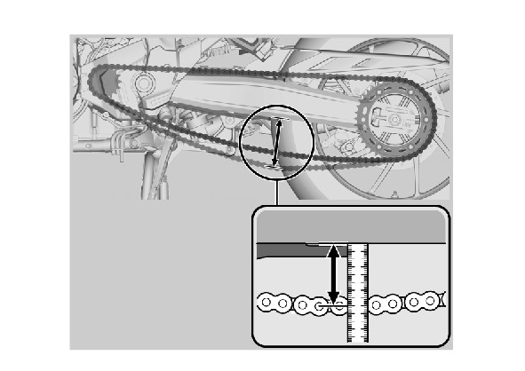

# Drive Chain - Adjustment

Источник: `Drive Chain - Adjustment.pdf`

DRIVE CHAIN SLACK INSPECTION 
Turn the ignition switch OFF, support the 
motorcycle on its mainstand, and shift the 
transmission into neutral. 
Check the slack in the drive chain lower run 
midway between the sprockets. 
DRIVE CHAIN SLACK: 
70 – 75 mm (2.8 – 3.0 in) 
* Excessive chain slack, 80 mm (3.2 in) or 
more, may damage the frame. 

