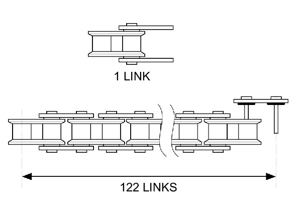
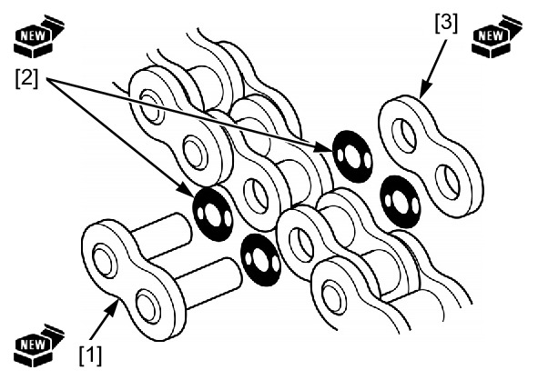
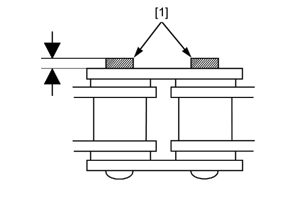
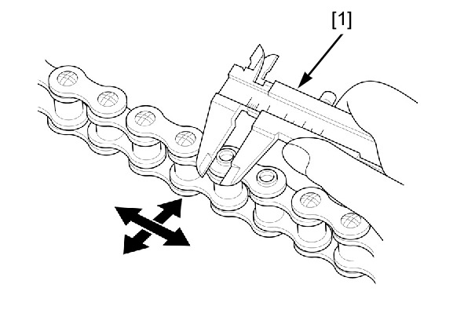

# Drive Chain - Replacement

Источник: `Drive Chain - Replacement.pdf`

REPLACEMENT 
This motorcycle uses a drive chain with a staked master link. 
Fully slacken the drive chain . 
Remove the drive chain using the special tool. 

NOTE: 
* When using the special tool, follow the manufacturer’s instruction. 
TOOL: 
Chain tool set 
07HMH-MR10105 
Remove the excess drive chain links from a new drive chain with the chain tool set. 
STANDARD LINKS: 122 LINKS 
REPLACEMENT CHAIN 
RK: 525MRO-122LE 
Insert a new master link [1] with new O-rings [2] from the inside of the drive chain. 
Install a new plate [3] and O-rings with the identification mark facing the outside. 
Assemble the master link, O-rings and plate. 
TOOL: 
Chain tool set 
07HMH-MR10105 

NOTE: 
* Never reuse the old drive chain, master link, master link plate, or O-rings. 

Make sure that the master link pins [1] are installed properly. 
Measure the master link pin length projected from the plate. 
STANDARD LENGTH: Approx 1.5 mm (0.06 in) 
Stake the master link pins. 
Make sure that the pins are staked properly by measuring the diameter of the staked area using a slide caliper [1]. 
DIAMETER OF THE STAKED AREA: 
5.40 – 5.60 mm (0.213 – 0.220 in) 
After staking, check the staked area of the master link for cracks. 
If there is any cracking, replace the master link, O-rings, and plate. 

