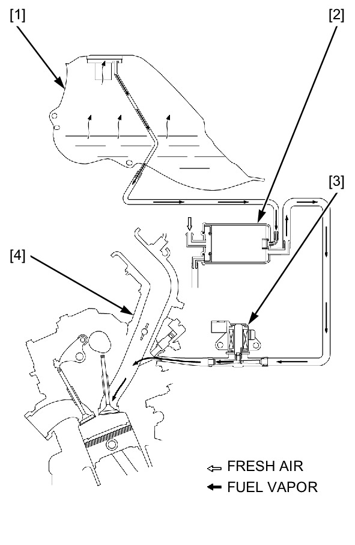
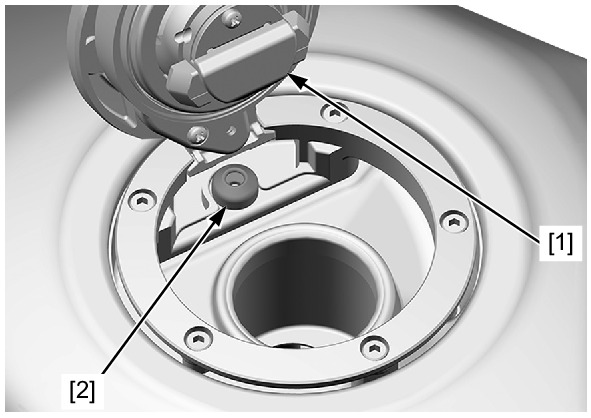

# EVAP

Источник: `EVAP.pdf`

EVAPORATIVE EMISSION CONTROL SYSTEM 
Remove the BCU tray . 
Check the hoses between the fuel tank [1], EVAP canister [2], EVAP purge control solenoid valve [3], and 
throttle body [4] for deterioration, damage or loose connection. 
Also, check that the hoses are not kinked, pinched or cracked. 
Check the EVAP canister for cracks or other damage. 
Refer to the Cable and Harness Routing for hose connections and routing . 
Page 1 of 2
30/07/2023

Open the fuel filler cap [1]. 
Check the breather seal [2] in the fuel filler cap for deterioration, cracks or damage. Replace it if necessary. 

NOTE: 
l Always replace the breather seal with a new one when the fuel filler cap is removed for service. 
Page 2 of 2
30/07/2023
