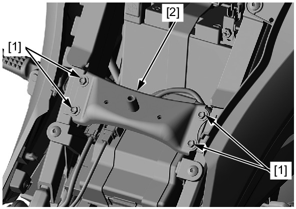

# Frame - Cross Plate (Fuel Tank)

Источник: `Frame - Cross Plate (Fuel Tank).pdf`

REMOVAL/INSTALLATION 
Remove the Fuel tank . 
Remove the front cross plate bolts [1] and front 
cross plate [2]. 
Installation is in the reverse order of removal. 
TORQUE: 
Front cross plate bolt: 
12 N·m (1.2 kgf·m, 9 lbf·ft) 

