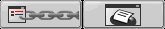
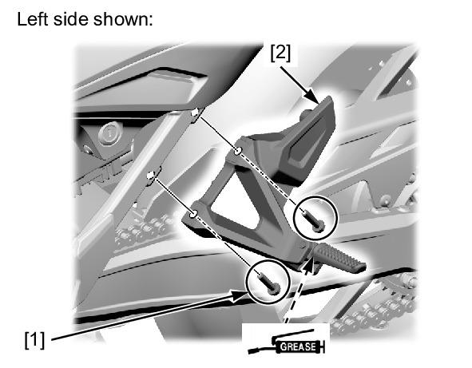

# Frame - Pillion Pegs

Источник: `Frame - Pillion Pegs.pdf`

Screen History PILLION STEP > REMOVAL/INSTALL...

S2MLF000A020027S2MLF000B020041




REMOVAL/INSTALLATION 
Remove the pillion step bracket bolts [1] and pillion 
step assembly [2]. 
Installation is in the reverse order of removal. 
TORQUE: 
Pillion step bracket bolt: 
32 N·m (3.3 kgf·m, 24 lbf·ft) 

NOTE: 
* Apply grease to the pillion step joint pin sliding 
area. 

c0080101 : PILLION STEP > REMOVAL/INSTALLATION
27/07/2023
https://www.ecom.honda-eu.com/emm10/servlet/honda.jp.hm.emm.apps.c008.C0080001Servlet?url=../../gma10/EMM/Contents/rel/sm/...
