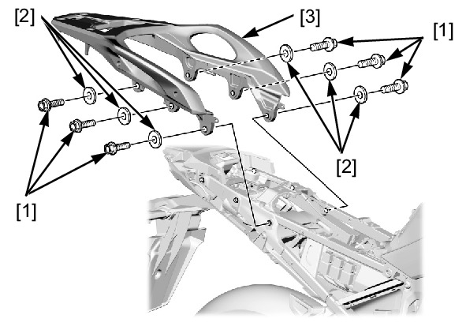

# Frame - Rear Carrier

Источник: `Frame - Rear Carrier.pdf`

REMOVAL/INSTALLATION 
Remove the rear side cowl . 
Remove the following: 
* Rear carrier bolts [1] 
* Washers [2] 
* Rear carrier [3] 
Installation is in the reverse order of removal. 
TORQUE: 
Rear carrier bolt: 
35 N·m (3.6 kgf·m, 26 lbf·ft) 

