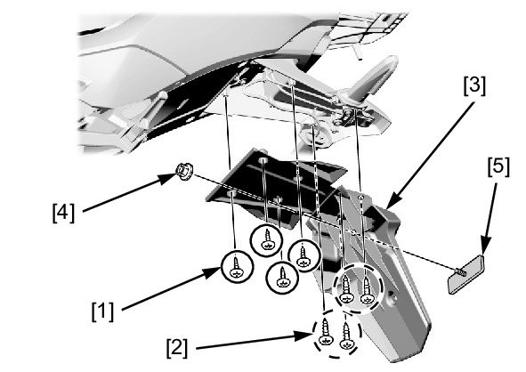

# Frame - Rear Fender A

Источник: `Frame - Rear Fender A.pdf`

REMOVAL/INSTALLATION 
Remove the following: 
* Tapping screws (4 mm) [1] 
* Tapping screws (5 mm) [2] 
* Rear fender A [3] 
* Rear reflector nut [4] 
* Reflector [5] 
Installation is in the reverse order of removal. 
TORQUE: 
Rear reflector nut: 
1.8 N·m (0.18 kgf·m, 1.3 lbf·ft) 

