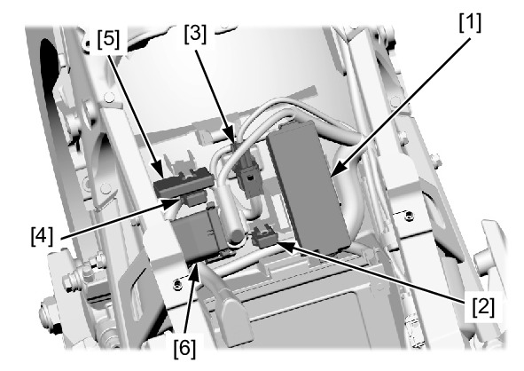
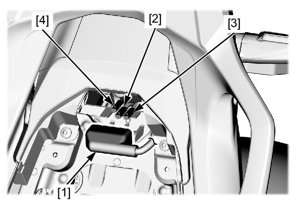
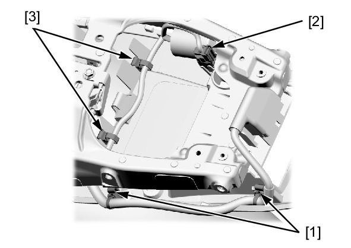
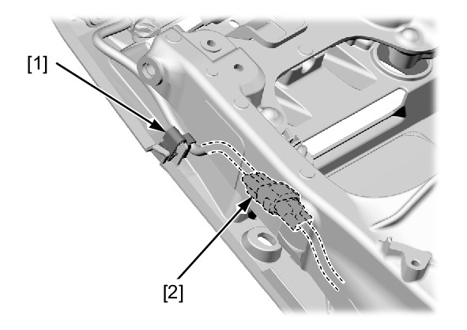
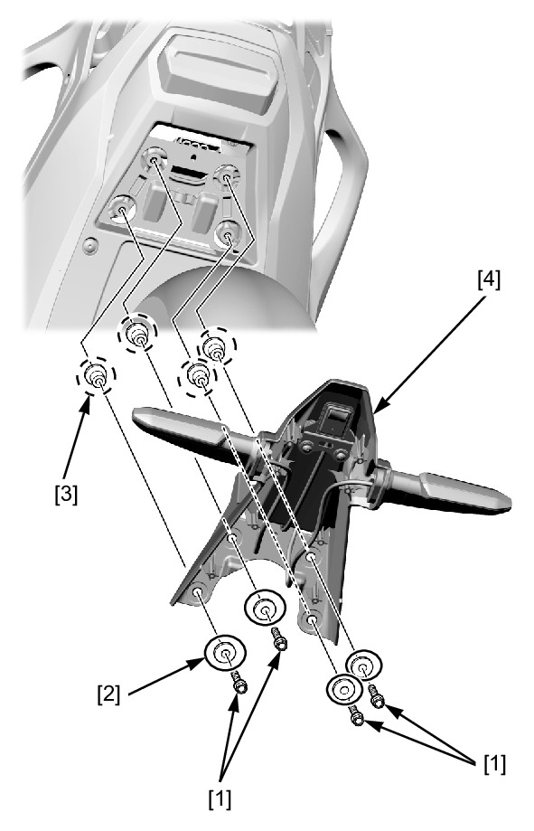
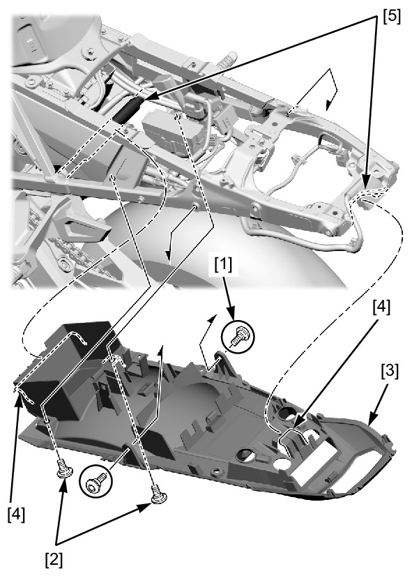

# Frame - Rear Fender B

Источник: `Frame - Rear Fender B.pdf`

REMOVAL/INSTALLATION 
Remove the following: 
* Regulator/rectifier cover 
* Rear center cowl 
* Brake/taillight 
* Rear fender A 
* Battery 
Release the following from the rear fender B: 
* Power box [1] 
* ABS FSR fuse box [2] 
* Main2, DCT-M (DCT model), FI fuse box connector 4P 
(Black) clip [3] 
* Main2 fuse box [4] 
* DCT-M (DCT model), FI fuse box [5] 
* Starter relay switch and cover [6] 

Release the connector cover [1] from the stay. 
Disconnect the license light 2P [2] and turn signal light 2P 
(Orange) [3] /(Light blue) [4] connector. 
Release the following from the rear fender B: 
* License light, turn signal light harness band clip [1] 
* DLC [2] 
* Brake/taillight harness band clip [3] 

Release the following from the rear fender B: 
* Brake/taillight and DLC harness band clip [1] 
* Brake/taillight harness connector [2] 

Remove the following from the rear fender B: 
* Bolts [1] 
* Washers [2] 
* Collars [3] 
* Rear fender A stay [4] 

Remove the following: 
* Socket bolts A [1] 
* Socket bolts B [2] 
* Rear fender B [3] 
Installation is in the reverse order of removal. 

NOTE: 
* Place the rear fender B hooks [4] onto the seat rail [5]. 
* Route the wires properly . 

