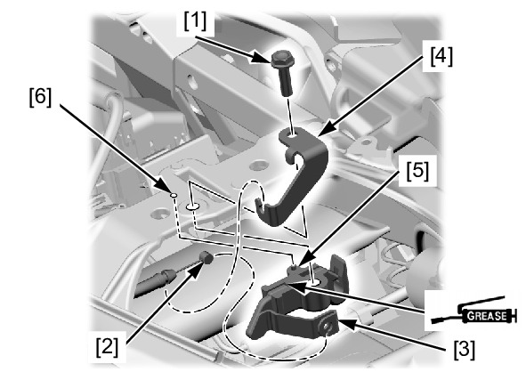
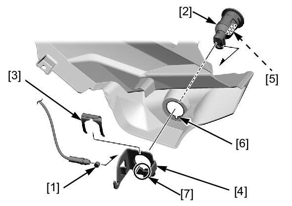

# Frame - Seat Lock & Catch

Источник: `Frame - Seat Lock & Catch.pdf`

REMOVAL/INSTALLATION 
SEAT CATCH HOOK 
Remove the pillion seat . 
Remove the bolt [1]. 
Disconnect the seat lock cable [2] from 
the seat catch hook [3] and seat lock 
cable B stay [4]. 
Remove the seat catch hook. 
Installation is in the reverse order of 
removal. 

NOTE: 
* Apply grease to the seat catch 
hook sliding area. 
* Align the seat catch hook boss 
[5] with the seat rail hole [6]. 

SEAT LOCK CYLINDER 
Remove the left fender B cover . 
Disconnect the seat lock cable [1] from 
the seat lock cylinder [2]. 
Remove the lock spring [3], seat lock 
cylinder, and stay [4]. 
Installation is in the reverse order of 
removal. 

NOTE: 
* Align the seat lock cylinder lug 
[5] with the left fender B cover 
groove [6] and stay groove [7]. 

