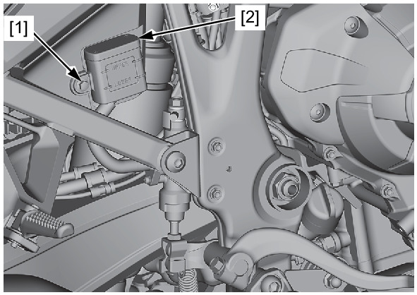
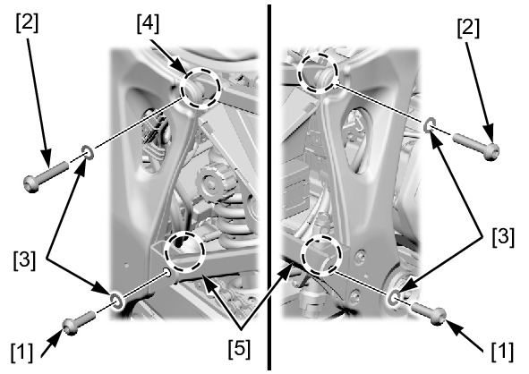
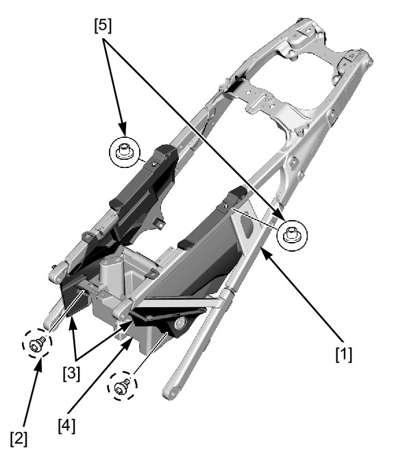

# Frame - Subframe

Источник: `Frame - Subframe.pdf`

REMOVAL/INSTALLATION 
Remove the following: 
* Heel guard 
* Pillion steps 
* Seat catch hook 
* ABS modulator 
* Rear fender B 
Remove the rear master cylinder reservoir 
mounting bolt [1] and release the rear master 
cylinder reservoir [2]. 

NOTE: 
* Keep the rear master cylinder reservoir 
upright to prevent air from entering the 
hydraulic system. 

Remove the following: 
* Seat rail socket bolts (short) [1] 
* Seat rail socket bolts (long) [2] 
* Washers [3] 
* Nuts [4] 
* Seat rail [5] 
Remove the following from the seat rail [1]: 
* Socket bolts [2] 
* Left/right rear fender B covers [3] 
* ABS modulator box [4] 

* Collars [5] 
Installation is in the reverse order of removal. 
TORQUE: 
Seat rail socket bolt: 
44 N·m (4.5 kgf·m, 32 lbf·ft) 
Rear master cylinder reservoir mounting 
bolt: 
10 N·m (1.0 kgf·m, 7 lbf·ft) 

NOTE: 
* Route the hose, wire, and cable properly . 
* For seat lock cylinder removal/installation . 

