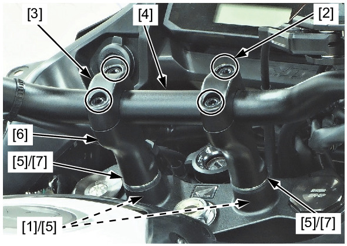
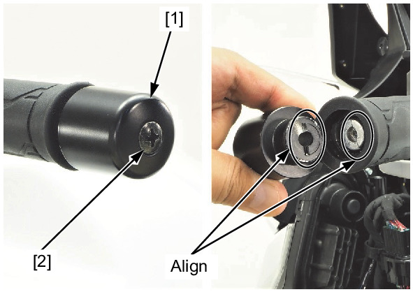

# Front - Handlebar(2)

Источник: `Front - Handlebar(2).pdf`

HANDLEBAR LOWER HOLDER REMOVAL/INSTALLATION 
Loosen the handlebar lower holder nuts [1]. 
Remove the following: 
* Handlebar upper holder bolts [2] 
* Handlebar upper holders [3] 
* Handlebar [4] 
Remove the following: 
* Handlebar lower holder nuts 
* Washers [5] 
* Handlebar lower holders [6] 
* Damper rubbers [7] 
Hold the handlebar weight [1] and remove the handlebar weight mounting screw [2], then remove both handlebar weights. 
Install the handlebar weight to the handlebar by aligning each cutout. 
Hold the handlebar weight. 
Install and tighten the handlebar weight mounting screw securely. 

