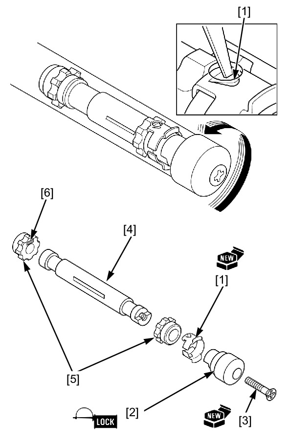
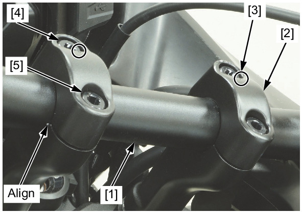

# Front - Handlebar

Источник: `Front - Handlebar.pdf`

HANDLEBAR WEIGHT REMOVAL/INSTALLATION 
Remove the following: 
* Left grip heater 
* Throttle grip 
Straighten the retainer tab [1] with a screwdriver or punch. 
Temporarily install the handlebar weight [2] and bolt [3], then remove the inner weight [4] by turning the handlebar weight. 
Remove the handlebar weight, retainer and rubber cushions from the inner weight. 
Discard the retainer. 
! Apply lubricant spray through the tab locking hole for easy 
removal. 
Install the rubber cushions [5] onto the inner weight. 
! Install the rubber cushion with identification mark [6] to the 
inward of inner weight. 
Install the new retainer onto the inner weight, aligning the flats each other. Tighten the new screw while holding the weight 
securely. 
Insert the weight assembly into the handlebar. 
Turn the handlebar weight and hook the retainer tab with the hole in the handlebar. 
Install the following: 
* Left grip heater 
* Throttle grip 
TORQUE: 
Handlebar weight bolt: 
10 N·m (1.0 kgf·m, 7 lbf·ft) 

Installation is in the reverse order of removal. 
TORQUE: 
Handlebar upper holder bolt: 
32 N·m (3.3 kgf·m, 24 lbf·ft) 
Handlebar lower holder nut: 
39 N·m (4.0 kgf·m, 29 lbf·ft) 

NOTE: 
* Align the paint mark on the handlebar [1] with the edge of lower holder. 
* Install the handlebar upper holders [2] with their punch marks [3] facing front. 
* When tightening the handlebar upper holder bolts, tighten the front bolts [4] first then the rear bolts [5]. 
* Apply locking agent to the handlebar weight bolt threads. 

