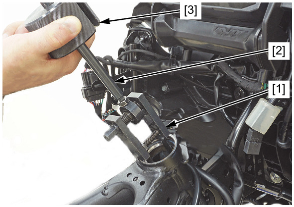
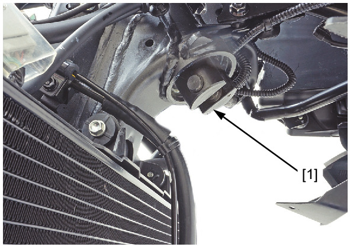
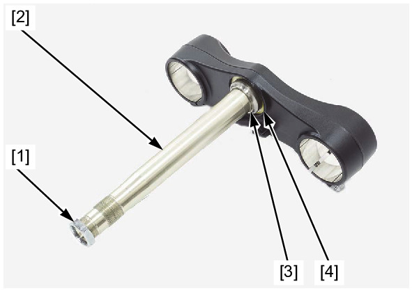
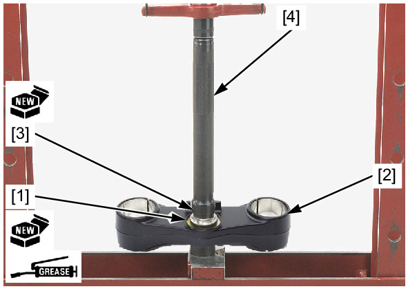
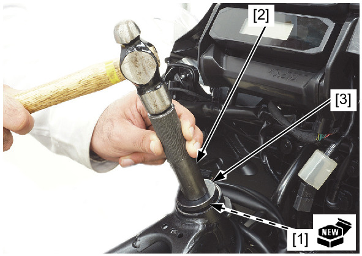
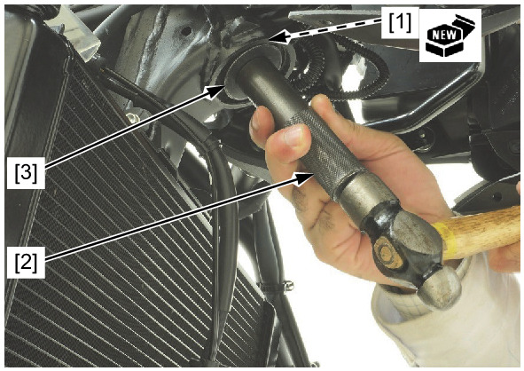

# Front - Steering Stem Bearing Replace

Источник: `Front - Steering Stem Bearing Replace.pdf`

BEARING REPLACEMENT 

NOTE: 
* Replace the bearing, outer race, and inner race as a set. 
Remove the upper outer race using a special tools. 
TOOLS: 
Adjustable bearing puller, 25 – 40 mm [1] 07JAC-PH80100 
Bearing remover shaft [2] 
07JAC-PH80200 
Weight, remover [3] 
07741-0010201 
Remove the lower outer race using the special tool and suitable shaft. 
TOOL: 
Ball race remover 44.5 [1] 
07946-3710500 

Temporarily install the steering stem nut [1] onto the steering stem [2] to prevent the threads from being damaged when 
removing the lower inner race [3] from the steering stem. 
Remove the lower inner race with a chisel or equivalent tools, being careful not to damage the steering stem. 
Remove the lower dust seal [4]. 
Apply specified grease to a new lower dust seal lips . 
Install the lower dust seal [1] to the steering stem [2]. 
Install a new lower inner race [3] using a hydraulic press and special tool. 
TOOL: 
Driver, 30 mm I.D. [4] 
07946-MB00000 

Drive in a new upper outer race [1] using the special tools. 
TOOLS: 
Driver handle, 15 x 135L [2] 07749-0010000 
Attachment, 42 x 47 mm [3] 07746-0010300 
Drive in a new lower outer race [1] using the special tools. 
TOOLS: 
Driver handle, 15 x 135L [2] 07749-0010000 
Attachment, 52 x 55 mm [3] 07746-0010400 

