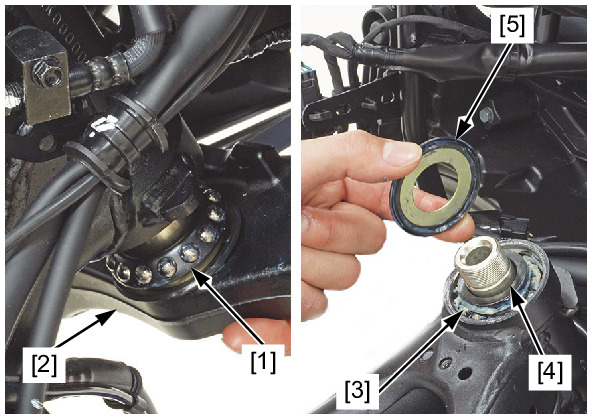
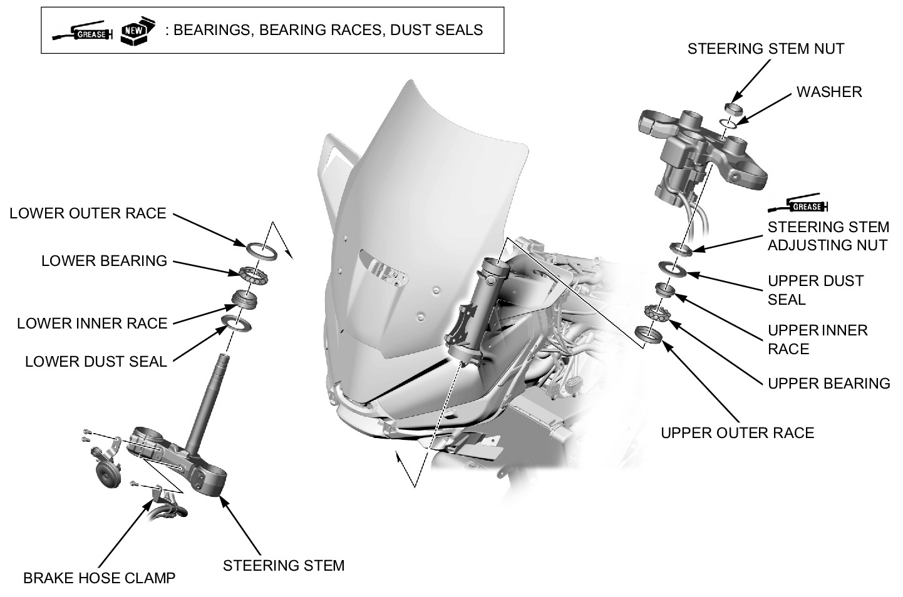
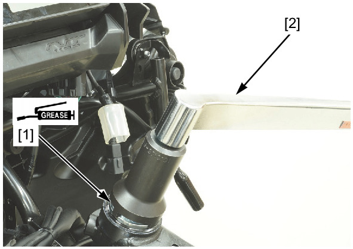
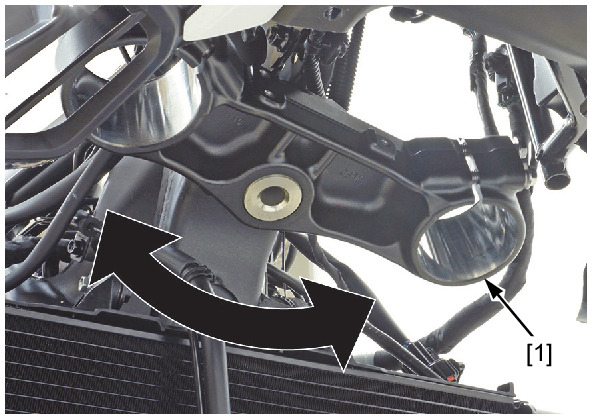
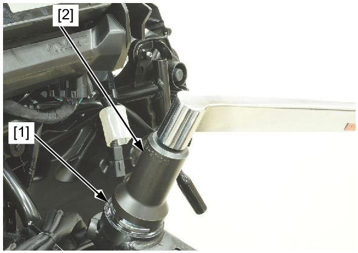
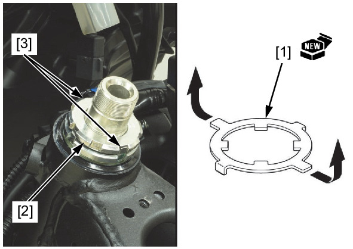
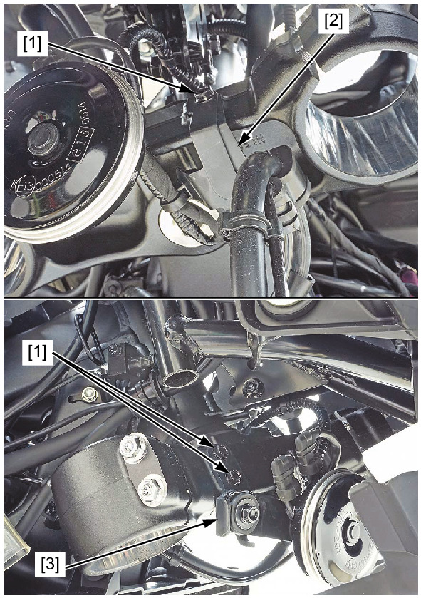
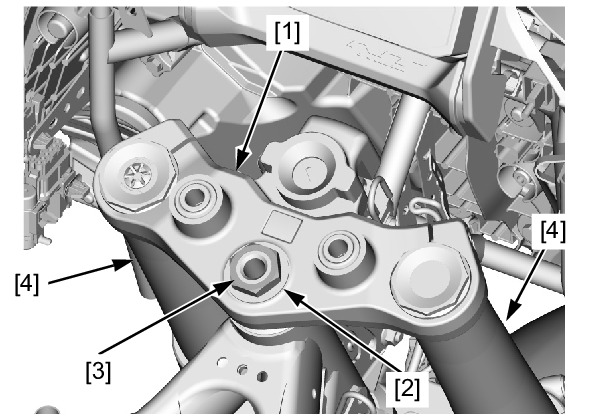
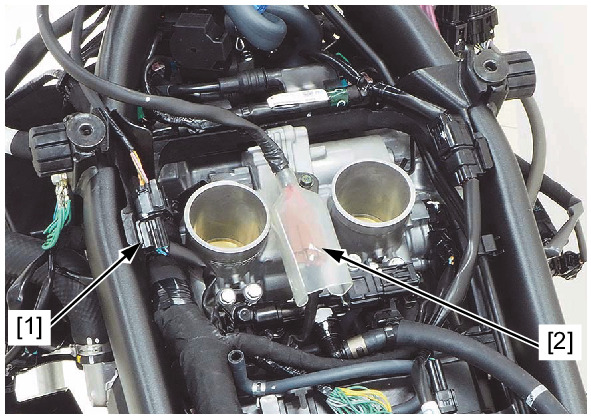

# Front - Steering Stem Install

Источник: `Front - Steering Stem Install.pdf`

INSTALLATION 
Apply specified grease to the upper and lower bearings and bearing races. 

Install the following: 
* Lower bearing [1] 
* Steering stem [2] 
* Upper bearing [3] 
* Upper inner race [4] 
* Upper dust seal [5] 
Apply 0.10 – 0.30 g (0.004 – 0.011 oz) of urea based multi-purpose extreme pressure grease NLGI #2 (EXCELITE EP2 manufactured by 
KYODO YUSHI CO., LTD. or equivalent) to the steering stem adjusting nut [1] threads. 
Tighten the adjusting nut to the initial torque by holding the steering stem. 
TOOL: 
Locknut wrench 5.8 x 45 [2] 07916-KA50100 
TORQUE: 30 N·m (3.1 kgf·m, 22 lbf·ft) 
Move the steering stem [1] right and left, lock-to-lock, five times to seat the bearings. 

Retighten the steering stem adjusting nut [1] to the specified torque using a special tool. 
TOOL: 
Locknut wrench 5.8 x 45 [2] 07916-KA50100 
TORQUE: 30 N·m (3.1 kgf·m, 22 lbf·ft) 
Recheck that the steering stem moves smoothly without play or binding. 
Install a new lock washer [1], aligning its bent tabs with the grooves in the adjustment nut. 
Install the lock nut [2] and finger tighten it all the way. 
Further tighten the lock nut, within 90°, to align its grooves with the tabs of the lock washer. 
! Do not over tighten the lock nut, this will flatten the 
lock washer. 
Bend the lock washer tabs [3] up into the grooves in the lock nut. 

Install the following: 
* Bolts [1] 
* Brake hose clamp [2] 
* Horn stay [3] 

Install the top bridge [1]. 
Install the washer [2] and steering stem nut [3], but do not tighten it yet. 
Temporarily install the forks [4]. 
Tighten the steering stem nut to the specified torque. 
TORQUE: 100 N·m (10.2 kgf·m, 74 lbf·ft) 
Turn the steering stem left and right, lock-to-lock several times to make sure the steering stem moves smoothly without play or binding. 
Connect the following: 
* Ignition switch 2P (Brown) connector [1] 
* Immobilizer receiver 4P (Black) connector [2] 
Install the following: 
* Air cleaner housing 
* Forks 
* Handlebar lower holder 

