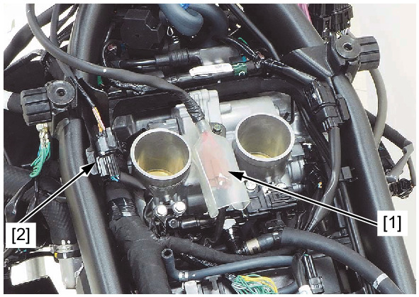
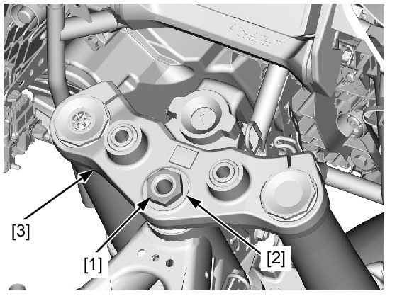
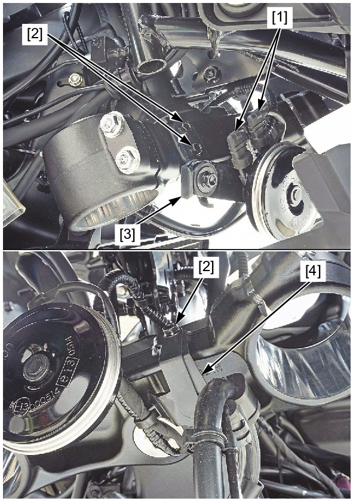
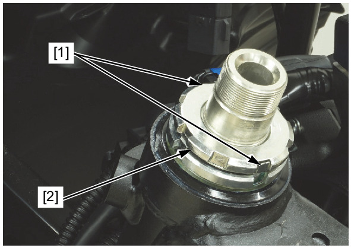
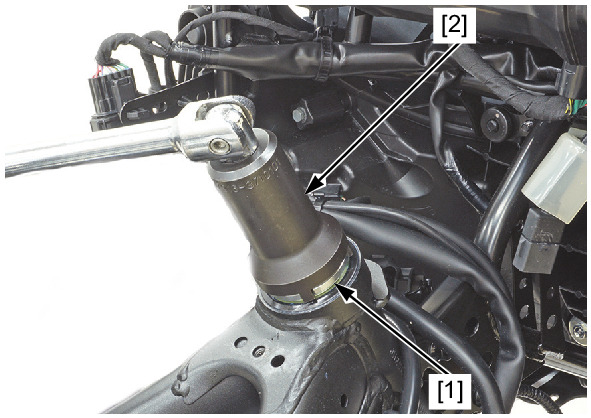
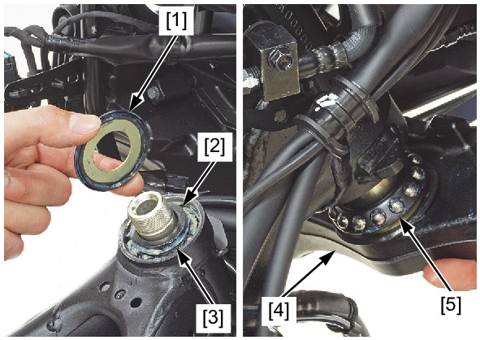

# Front - Steering Stem Remove

Источник: `Front - Steering Stem Remove.pdf`

REMOVAL 
Remove the following: 
* Air cleaner housing 
* Handlebar lower holder 
* Forks 
Disconnect the following: 
* Ignition switch 2P (Brown) connector [1] 
* Immobilizer receiver 4P (Black) connector [2] 
Remove the following: 
* Steering stem nut [1] and washer [2]. 
* Top bridge [3] 

Disconnect the horn connector [1]. 
Remove the following: 
* Bolts [2] 
* Horn stay [3] 
* Brake hose clamp [4] 

Straighten the lock washer tabs [1]. 
Remove the lock nut [2] and lock washer. 
Loosen and remove the steering stem adjusting nut [1] using the special tool. 
TOOL: 
Locknut wrench 5.8 x 45 [2] 07916-KA50100 

Remove the following: 
* Upper dust seal [1] 
* Upper inner race [2] 
* Upper bearing [3] 
* Steering stem [4] 
* Lower bearing [5] 

