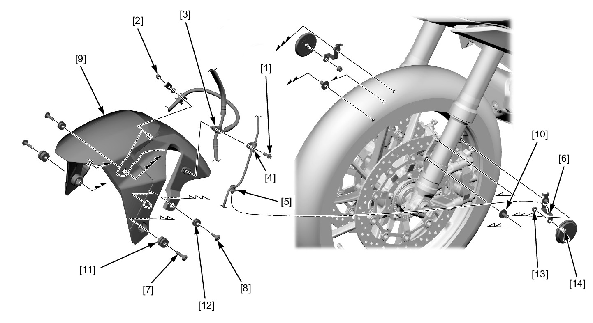

# Front Fender

Источник: `Front Fender.pdf`

REMOVAL/INSTALLATION 
Remove the following from the front fender: 
* Bolt [1] 
* Nut [2] 
* Brake hose clamp [3] 
* Front wheel speed sensor wire clamp [4] 
Release the front wheel speed sensor wire clip [5] from the fender A stay collar [6]. 
Remove the long socket bolts [7], short socket bolts [8] and front fender [9]. 
Remove the collars [10], rubber cushion A [11] and rubber cushion B [12] from the front fender. 
Remove the front side reflector nuts [13] and front side reflectors [14] from the fender A stay collar. 
Installation is in the reverse order of removal. 
TORQUE: 
Front side reflector nut: 
1.8 N·m (0.2 kgf·m, 1.3 lbf·ft) 

NOTE: 
* Route the wire and hoses properly . 

