# Front Fork - Assembly

Источник: `Front Fork - Assembly.pdf`

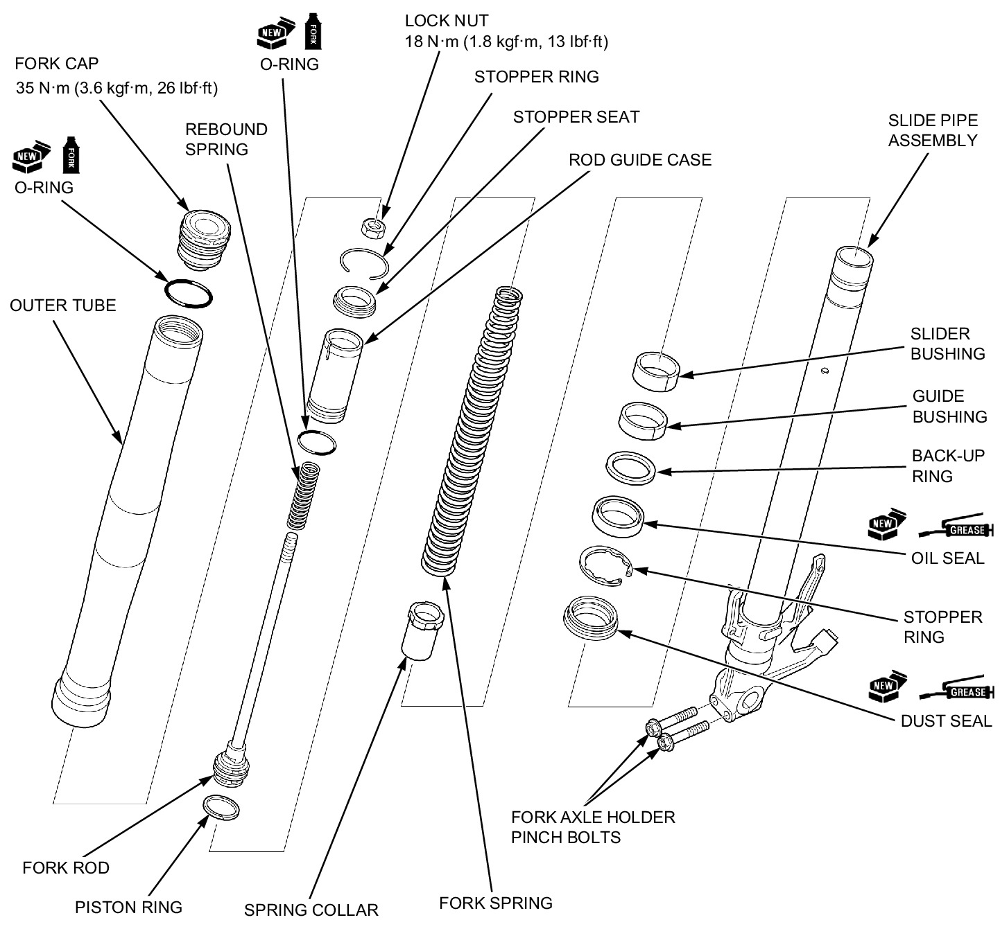

ASSEMBLY 
Before assembly, wash all parts with a high flash point or non-flammable solvent and wipe them off completely. 
RIGHT SIDE: 

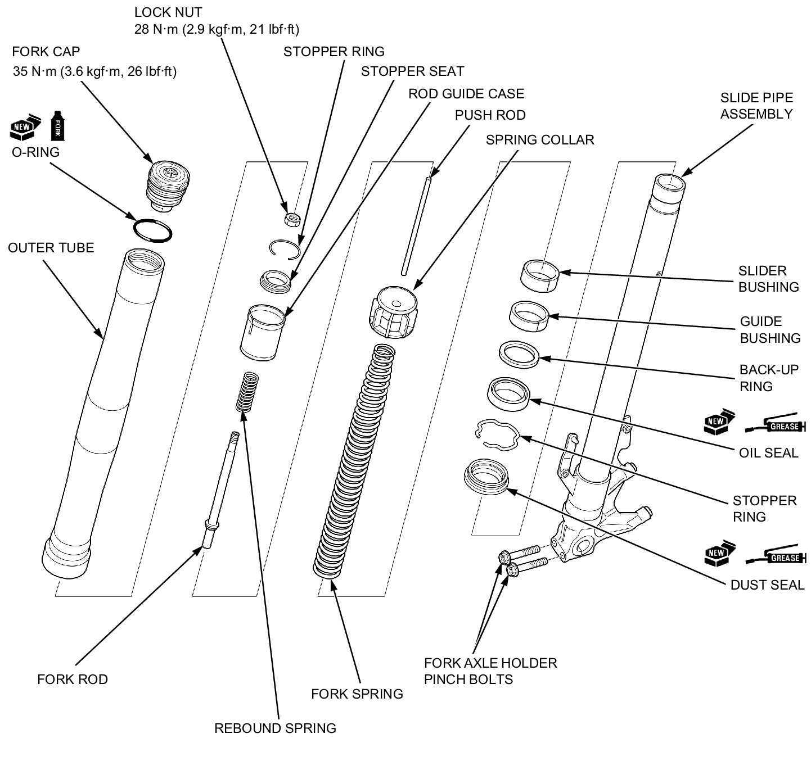

LEFT SIDE: 
When installing the fork dust seal and oil seal, wrap the edge and groove of the slide pipe with tape [1]. 

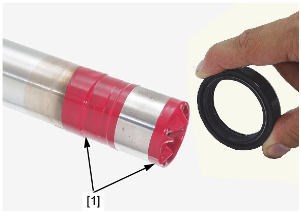

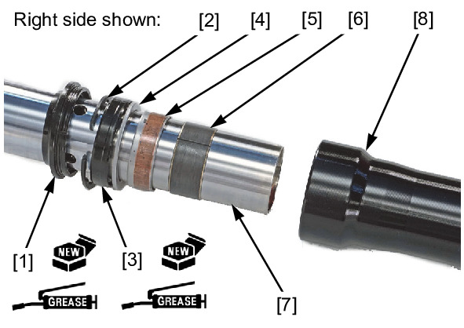

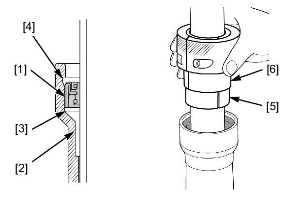

Apply grease to new dust seal and oil seal lips. 
Install the dust seal [1], stopper ring [2] and oil seal [3]. 
! Install the oil seal with its marked side facing toward the axle holder. 
Install the back-up ring [4] and guide bushing [5]. 
Install the slider bushing [6] if they are removed. 

NOTE: 
* Remove any burrs from the bushing mating surface, being careful not to peel off the coating. 
* Do not open the slider bushing slit more than necessary. 
Install the slide pipe assembly [7] into the outer tube [8]. 
Drive the oil seal [1] with the guide bushing [2] and back-up ring [3] into the outer tube until the stopper ring groove [4] is visible using the special tools. 
TOOLS: 
Fork seal driver attachment 41.3 [5] 07RMD-MW40100 
Fork seal driver 45.2 [6] 
07KMD-KZ30100 
Install the stopper ring [1] into the groove securely. 
! Do not scratch the fork pipe sliding surface. 
Install the dust seal [2]. 

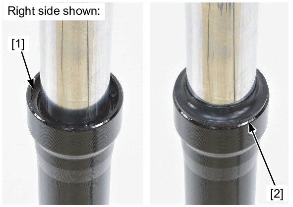

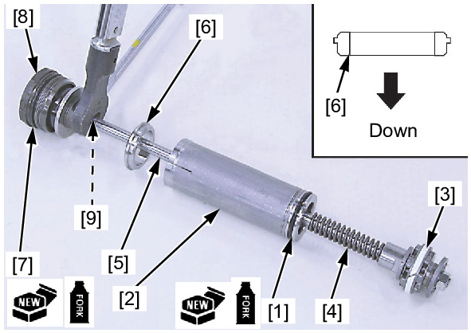

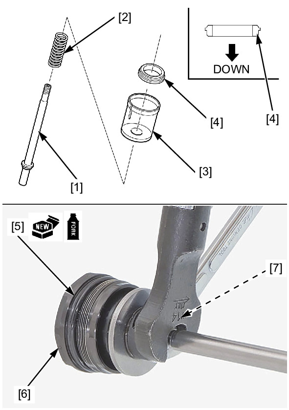

Apply fork fluid to new O-rings. 
! Right side: 
Install the O-ring [1] to the rod guide case [2]. 
Install the piston ring [3], rebound spring [4] and rod guide case to the fork rod [5]. 
Install the stopper seat [6] in the shown direction. 
Install the O-ring [7] to the fork cap [8]. 
Install the fork cap to the fork rod and tighten it until it stops. 
Hold the fork cap then tighten the fork rod lock nut [9] to the specified torque. 
TORQUE: 18 N·m (1.8 kgf·m, 13 lbf·ft) 
Install the following to the fork rod [1]. 
! Left side: 
* Rebound spring [2] 
* Rod guide case [3] 
Install the stopper seat [4] in the shown direction. 
Apply fork fluid to a new O-ring [5]. 
Install the O-ring to the fork cap [6]. 
Install the fork cap to the fork rod and tighten it until it stops. 
Hold the fork cap then tighten the fork rod lock nut [7] to the specified torque 
TORQUE: 28 N·m (2.9 kgf·m, 21 lbf·ft) 

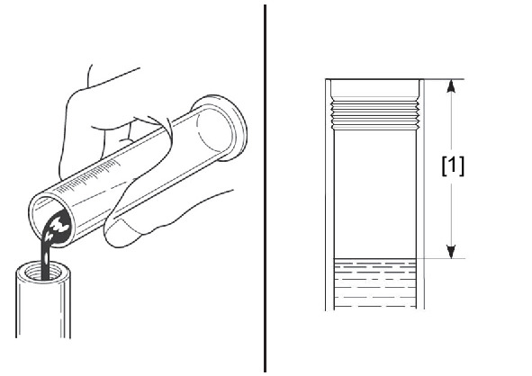

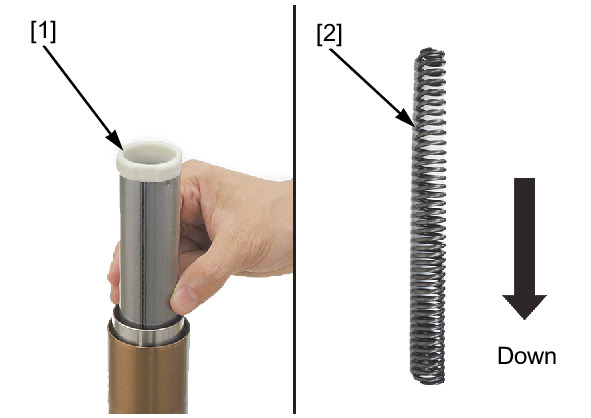

Pour the specified amount of recommended fork fluid into the fork pipe. 
RECOMMENDED FORK FLUID: 
Fork fluid (viscosity: 10W) 
FORK FLUID CAPACITY [1]: 
RIGHT SIDE: 
600 ± 2.5 cm 3 (20.3 ± 0.1 US oz, 21.1 ± 0.1 Imp oz) 
LEFT SIDE: 
593 ± 2.5 cm 3 (20.1 ± 0.1 US oz, 20.9 ± 0.1 Imp oz) 
Slowly pump the fork pipe several times to remove the trapped air from the lower portion of the fork pipe. 
Compress the fork pipe fully and leave it for 5 minutes to remove air bubbles from the fluid. 
Measure the oil level from the top of the fork pipe by supporting the fork leg vertically. 
FORK FLUID LEVEL: 
RIGHT SIDE: 72 mm (2.8 in) 
LEFT SIDE: 196 mm (7.7 in) 
Install the spring collar [1]. 
Install the fork spring [2] into the slide pipe assembly with the tightly wound side facing down. 
Apply fork fluid to the O-rings [1]. 
Install the fork rod assembly by pushing the rod guide case [2] into the slide pipe assembly. 

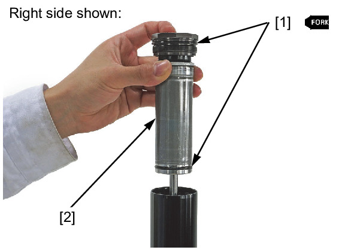

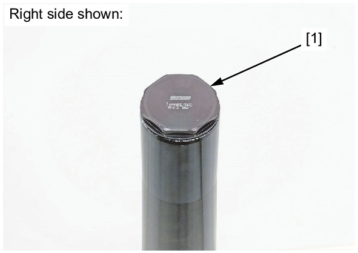

Install the stopper ring [1] into the groove in the fork pipe. 
Completely extend the outer tube. 
Install and tighten the fork cap [1] into the outer tube. 
Tighten the fork cap to the specified torque after installing the fork leg into the steering stem . 

