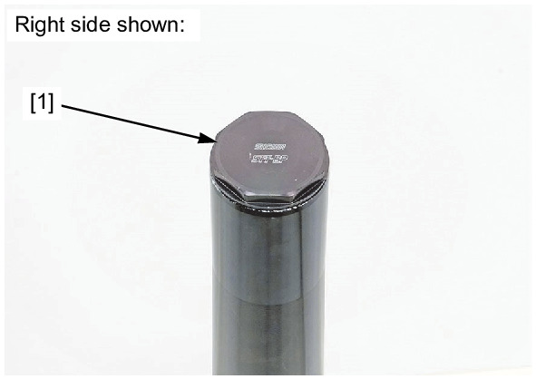
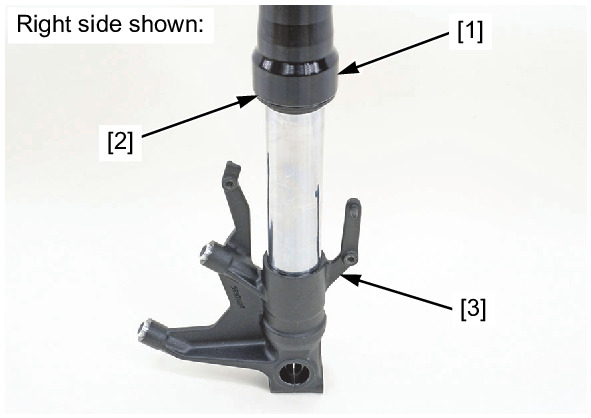
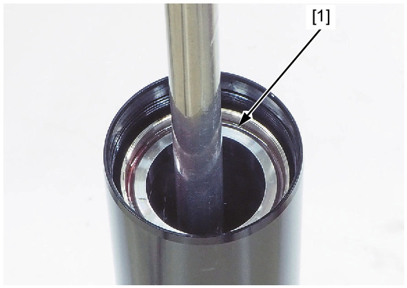
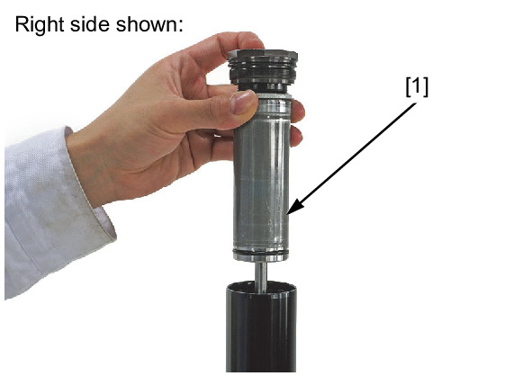
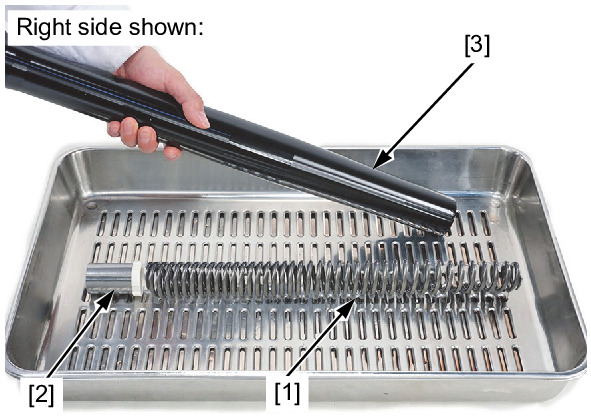
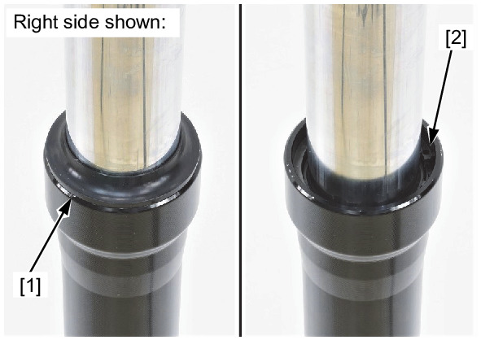
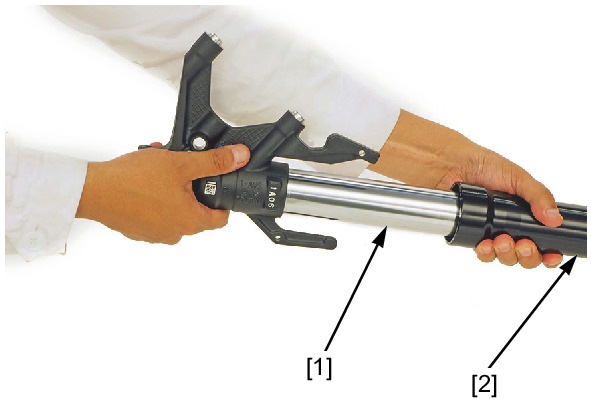
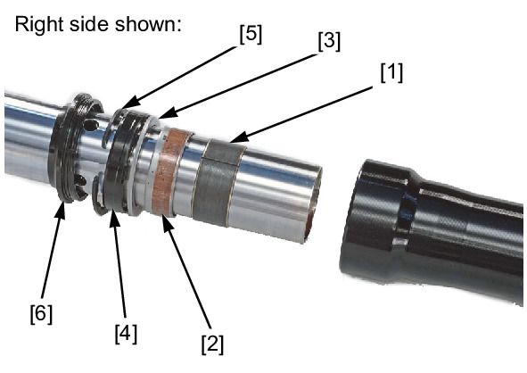
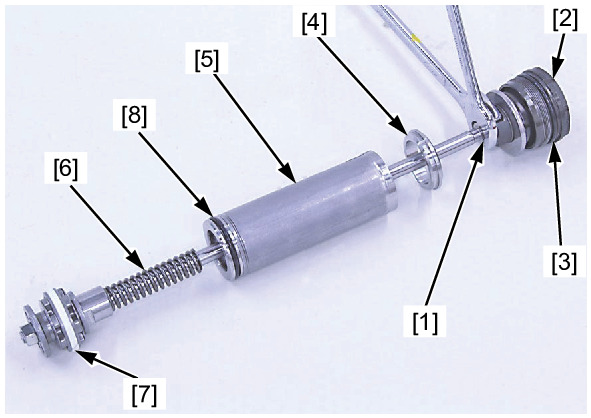
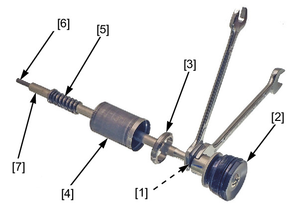

# Front Fork - Disassembly

Источник: `Front Fork - Disassembly.pdf`

DISASSEMBLY 
Remove the fork cap [1] with the special tool. 
TOOL: 
Fork bolt wrench 
070MA-MGP0100 
Push the outer tube [1] slowly down, and gently seat the dust seal [2] onto the axle holder [3]. 

Remove the stopper ring [1] from the groove in the fork pipe. 
Pull up and remove the fork rod assembly [1]. 

Remove the fork spring [1] and spring collar [2]. 
Pour out the fork fluid by pumping the outer tube [3] several times. 
Remove the dust seal [1]. 
Remove the stopper ring [2]. 
! Be careful not to scratch the slide 
pipe sliding surface. 

Pull the slide pipe assembly [1] out until you feel resistance from the slider bushing. Then move it in and out, tapping 
the bushing lightly until the outer tube [2] separates from the slide pipe assembly. 
The guide bushing will be forced out by the slider bushing. 
Carefully remove the slider bushing [1] by prying the slot with a screwdriver until the slider bushing can be pulled off by 
hand. 
! Do not damage the slider bushing, especially the 
sliding surface. To prevent loss of tension, do not open 
the slider bushing more than necessary. 
Remove the following: 
* Guide bushing [2] 
* Back-up ring [3] 
* Oil seal [4] 
* Stopper ring [5] 
* Dust seal [6] 

Loosen the lock nut [1] while holding the fork cap [2], then remove the fork cap. 
! Right side: 
Remove the O-ring [3] from the fork cap groove. 
Remove the stopper seat [4], rod guide case [5], rebound spring [6] and piston ring [7]. 
Remove the O-ring [8] from the rod guide case. 
Loosen the lock nut [1] while holding the fork cap [2], then remove the fork cap. 
! Left side: 
Remove the stopper seat [3], rod guide case [4], rebound spring [5]. 
Remove the push rod [6] from the rod [7]. 

