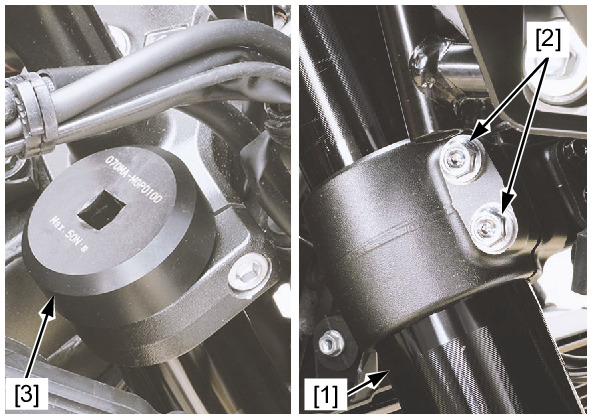
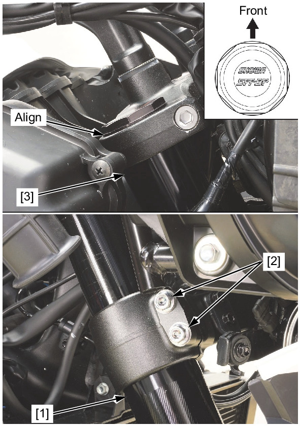
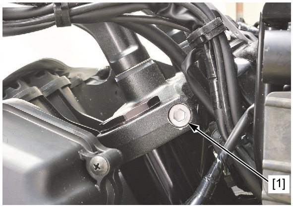
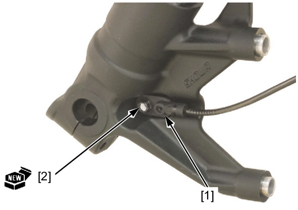

# Front Fork - Install

Источник: `Front Fork - Install.pdf`

INSTALLATION 
When the fork is disassembled: 
Insert the fork leg [1] into the bottom bridge, top bridge and temporarily tighten the pinch bolts [2]. 
Tighten the fork cap to the specified torque using the special tools. 
TOOL: 
Fork bolt wrench [3] 
070MA-MGP0100 
TORQUE: 35 N·m (3.6 kgf·m, 26 lbf·ft) 
Support the fork leg [1] securely. 
Loosen the bottom bridge pinch bolts [2]. 
Install the fork leg into the bottom bridge, top bridge. 
! Route the wires, cables and hose properly . 
Align the top end of the fork pipe [3] with the upper surface of the top bridge as shown. 
Tighten the bottom bridge pinch bolts to the specified torque. 
TORQUE: 25 N·m (2.5 kgf·m, 18 lbf·ft) 

Tighten the top bridge pinch socket bolt [1] to the specified torque. 
TORQUE: 22 N·m (2.2 kgf·m, 16 lbf·ft) 

Install the front wheel speed sensor [1] and new mounting bolt [2] onto the left fork. 
! Left side only: 

NOTE: 
* Always replace the front wheel speed sensor mounting bolts with new ones. 
Install the following: 
* Front fender 
* Front wheel 
* Inner cover 

