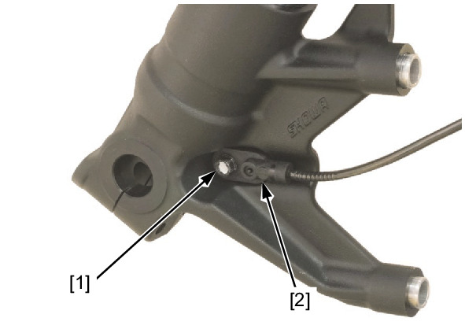
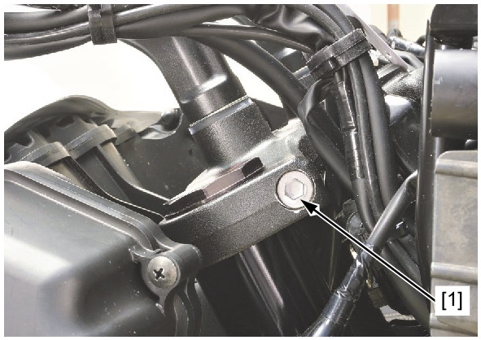
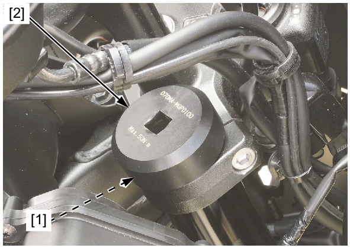
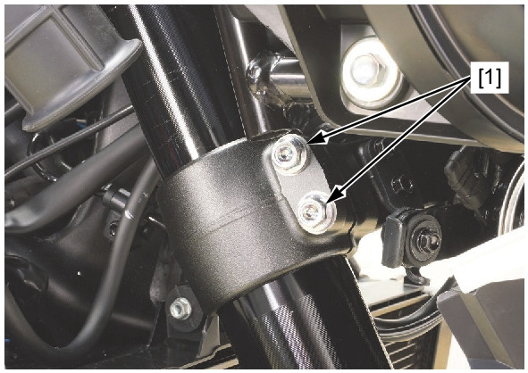

# Front Fork - Removal

Источник: `Front Fork - Removal.pdf`

REMOVAL 
Remove the following: 
* Front wheel 
* Front fender 
* Inner cover 
Remove the bolt [1] and front wheel speed sensor [2] from the left fork. 
! Left side only: 
Loosen the pinch socket bolt [1] of the top bridge. 

When the fork leg will be disassembled, loosen the fork cap [1], but do not remove it yet. 
! Take care not to scratch the cap head. 
TOOL: 
Fork bolt wrench [2] 
070MA-MGP0100 
While holding the fork leg, loosen the bottom bridge pinch bolts [1]. Pull the fork leg down and remove it out of the fork 
bridges. 

