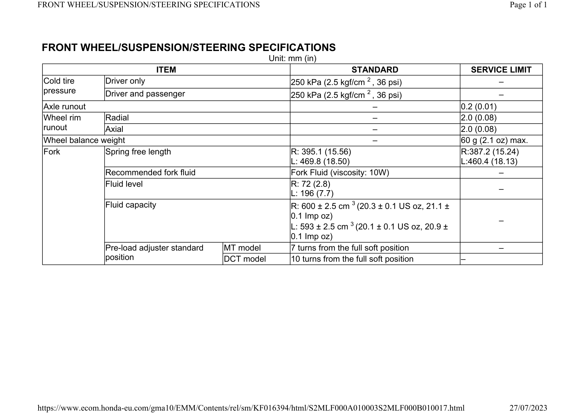

# Front Suspension Specifications

Источник: `Front Suspension Specifications.pdf`

FRONT WHEEL/SUSPENSION/STEERING SPECIFICATIONS 
Unit: mm (in) 
ITEM 
STANDARD 
SERVICE LIMIT 
Cold tire 
pressure 
Driver only 
250 kPa (2.5 kgf/cm 2 , 36 psi) 
– 
Driver and passenger 
250 kPa (2.5 kgf/cm 2 , 36 psi) 
– 
Axle runout 
– 
0.2 (0.01) 
Wheel rim 
runout 
Radial 
– 
2.0 (0.08) 
Axial 
– 
2.0 (0.08) 
Wheel balance weight 
– 
60 g (2.1 oz) max. 
Fork 
Spring free length 
R: 395.1 (15.56) 
L: 469.8 (18.50) 
R:387.2 (15.24) 
L:460.4 (18.13) 
Recommended fork fluid 
Fork Fluid (viscosity: 10W) 
– 
Fluid level 
R: 72 (2.8) 
L: 196 (7.7) 
– 
Fluid capacity 
R: 600 ± 2.5 cm 3 (20.3 ± 0.1 US oz, 21.1 ± 
0.1 Imp oz) 
L: 593 ± 2.5 cm 3 (20.1 ± 0.1 US oz, 20.9 ± 
0.1 Imp oz) 
– 
Pre-load adjuster standard 
position 
MT model 
7 turns from the full soft position 
– 
DCT model 
10 turns from the full soft position 
– 

