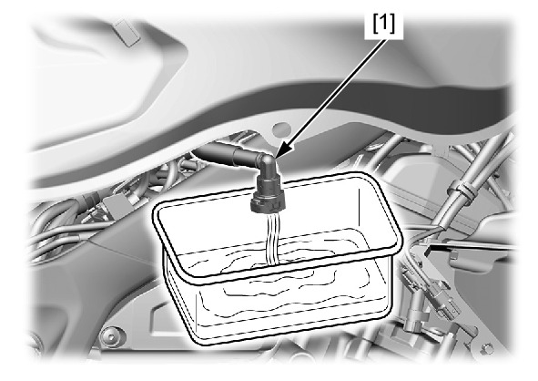
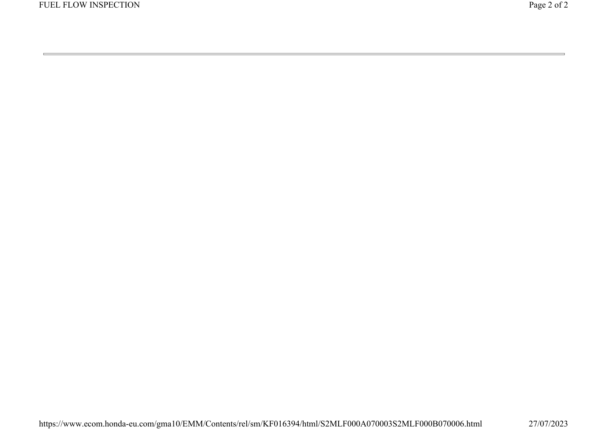

# Fuel - Flow Inspection

Источник: `Fuel - Flow Inspection.pdf`

FUEL FLOW INSPECTION 
Disconnect the quick connect fitting from the fuel 
rail . 
Place the end of the fuel feed hose [1] into an 
approved fuel container. 

NOTE: 
* Clean up any spilled fuel. 
Temporarily connect the battery negative (–) cable 
and fuel pump unit 5P (Black) connector. 
Turn the ignition switch ON. 
Measure the amount of fuel flow. 

NOTE: 
* The fuel pump operates for 2 seconds. 
Repeat this procedure 5 times to meet the 
total measuring time. 
* Return fuel to the fuel tank when the 
measurement is completed. 

Amount of fuel flow: 
319 cm3 (10.8 US oz, 11.2 Imp oz) minimum/ 
10 seconds at 12 V 

If the fuel flow is less than specified, inspect the 
following: 
* Pinched or clogged fuel hose or fuel tank 
breather hose 
* Fuel pump unit 
Connect the quick connect fitting . 

