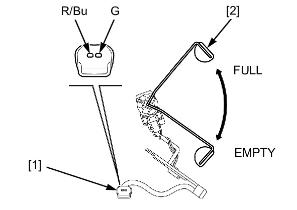

# Fuel - Level Sensor Inspection

Источник: `Fuel - Level Sensor Inspection.pdf`

FUEL LEVEL SENSOR INSPECTION 
Remove the fuel level sensor . 
Connect the ohmmeter to the fuel level sensor 2P 
(Black) connector [1]. 
CONNECTION: Red/blue – Green 
Measure the resistance with the float [2] at the full 
and empty positions. 
FULL 
EMPTY 
Resistance 
6 – 10 Ω 
434 – 446 Ω 
If it is out of specification, replace the fuel level 
sensor . 

