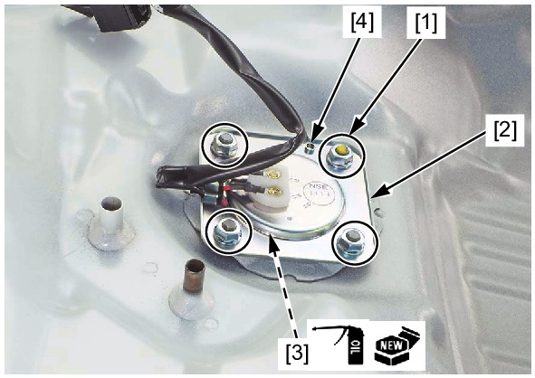

# Fuel - Level Sensor

Источник: `Fuel - Level Sensor.pdf`

FUEL LEVEL SENSOR REMOVAL/INSTALLATION 
Remove the fuel tank . 
Remove the nuts [1]. 
Remove the fuel level sensor [2] and O-ring [3]. 
Installation is in the reverse order of removal. 

NOTE: 
* Replace the O-ring with a new one. 
* Apply engine oil to a new O-ring. 
* Align the sensor plate hole [4] with the tank 
boss. 

