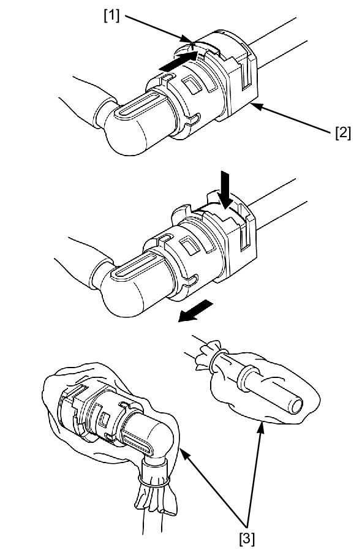

# Fuel - Line Disconnect

Источник: `Fuel - Line Disconnect.pdf`

Screen History FUEL LINE INSPECTION > QUICK C...

S2MLF000A070003S2MLF000B070003




QUICK CONNECT FITTING REMOVAL/INSTALLATION 

NOTE: 
* Clean around the quick connect fitting before disconnecting 
the fuel feed hose, and be sure that no dirt is allowed to enter 
into the fuel system. 
* Do not bend or twist the fuel feed hose. 
Relieve the fuel pressure . 
Disconnect the battery negative (–) cable . 
Push the retainer tab [1] forward. 
Press down the retainer and disconnect the connector [2] from the 
fuel pump joint/fuel rail. 

NOTE: 
* To prevent damage and keep foreign matter out, cover the 
disconnected connector and pipe end with the plastic bags [3]. 
Press the connector onto the fuel pump joint/fuel rail until the 
retainer locks with a “CLICK”. 

NOTE: 
* If it is hard to connect, put a small amount of engine oil on the 
pipe end. 
Make sure the connection is secure; check visually and by pulling 
the connector. 
Increase the fuel pressure . 

c0080101 : FUEL LINE INSPECTION > QUICK CONNECT FITTING REMOVAL/INSTALLATION
27/07/2023
https://www.ecom.honda-eu.com/emm10/servlet/honda.jp.hm.emm.apps.c008.C0080001Servlet?url=../../gma10/EMM/Contents/rel/sm/...
