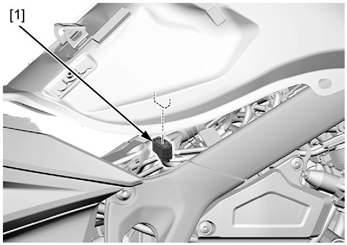
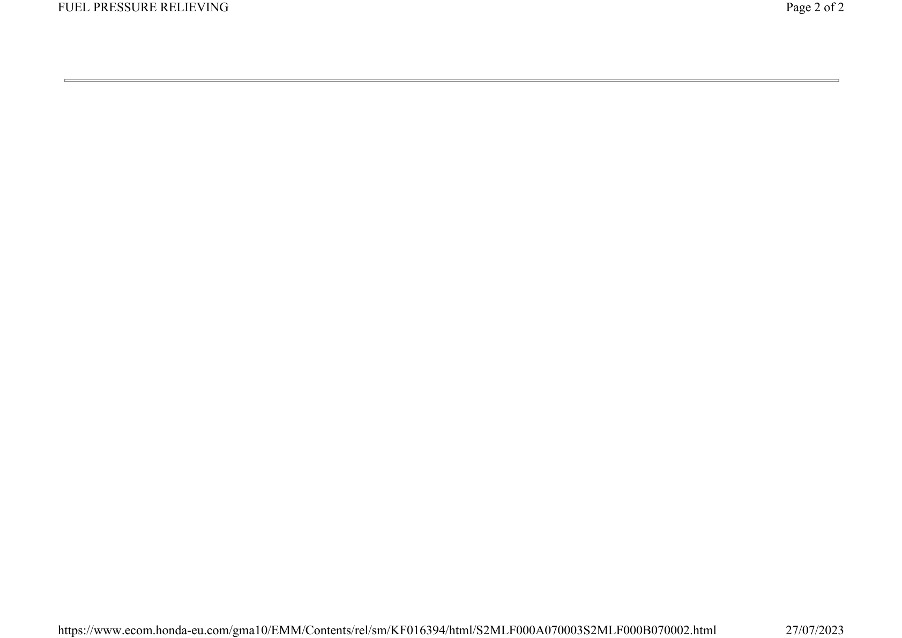

# Fuel - Line Pressure Relieve

Источник: `Fuel - Line Pressure Relieve.pdf`

FUEL PRESSURE RELIEVING 

NOTE: 
* Before disconnecting the fuel hose, relieve 
pressure from the system as follows. 
1. Turn the ignition switch OFF. 
2. Lift and support the fuel tank . 
3. Disconnect the fuel pump unit 5P (Black) connector [1]. 
4. Start the engine and let it idle until the engine stalls. 
5. Turn the ignition switch OFF. 

