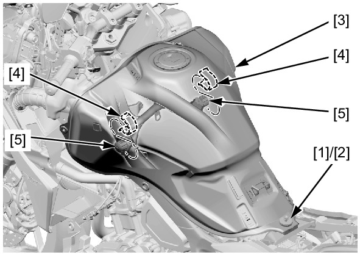
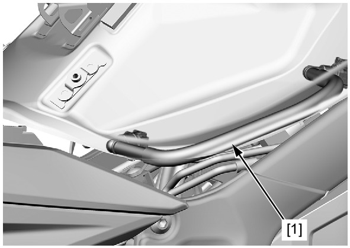

# Fuel - Line

Источник: `Fuel - Line.pdf`

FUEL LINE 
Remove the following: 
* Main seat 
* Middle cowl 
* Tank front cover 
Remove the bolt [1] and washer 
[2]. 
Lift the fuel tank [3] by releasing 
its grooves [4] from the mounting 
rubbers [5]. 
Support the fuel tank using a 
suitable support. 

Check the fuel line [1] for 
deterioration, damage or 
leakage. Replace the fuel line if 
necessary. 
Also check the fuel line fittings 
for leakage. 
Install the removed parts in the 
reverse order of removal. 

