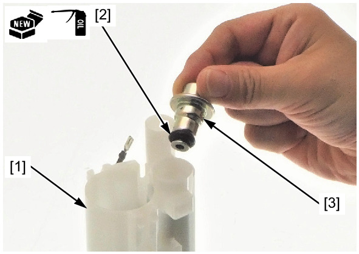
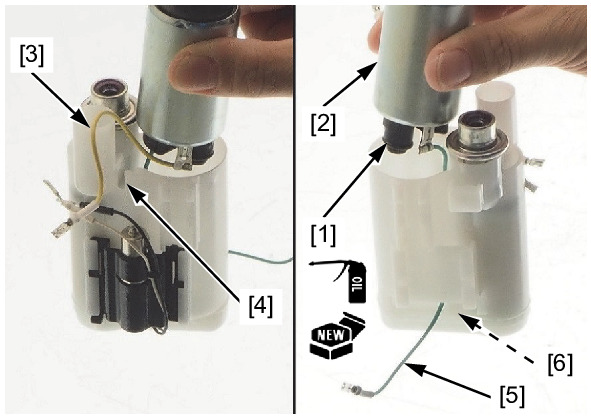
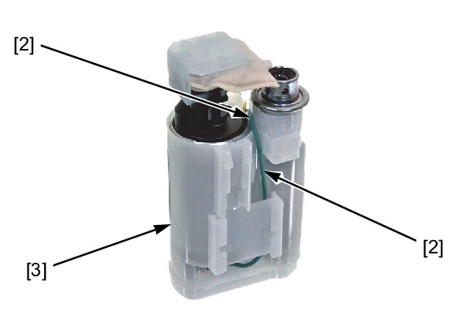
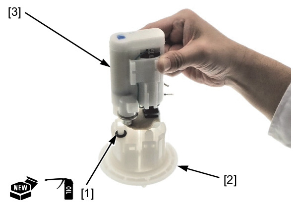
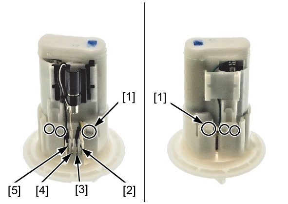

# Fuel - Pump Assembly

Источник: `Fuel - Pump Assembly.pdf`

ASSEMBLY 
Replace the fuel filter [1] with a new one. 
Apply engine oil to a new O-ring. 
Install the O-ring [2] to new pressure regulator [3]. 
Install the pressure regulator. 
Apply engine oil to a new O-ring. 
Install the O-ring [1] to the fuel pump [2]. 
Install the fuel pump. 

NOTE: 
* Align the Yellow wire [3] with the fuel filter groove [4]. 
* Lead the Green wire [5] through the hole [6] of the fuel filter as shown. 

Set the Green wire [1] through the groove [2] of the fuel filter [3] as shown. 
Apply engine oil to a new O-ring. 
Install the O-ring [1] to the flange [2]. 
Install the fuel filter unit [3]. 

Install the following: 
* Tabs [1] 
* Yellow wire connector [2] 
* Green wire connector [3] 
* White wire connector [4] 
* Black wire connector [5] 

