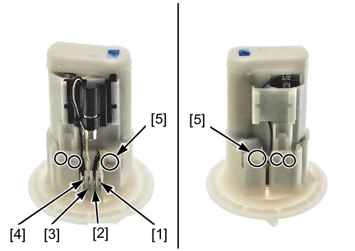
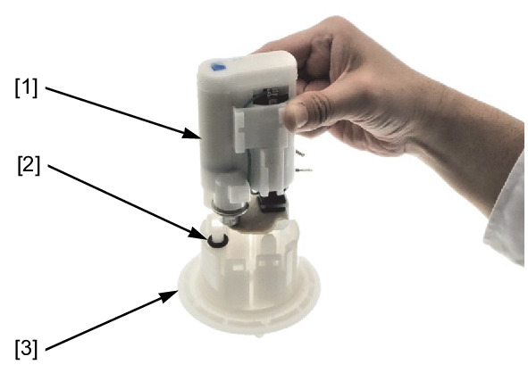
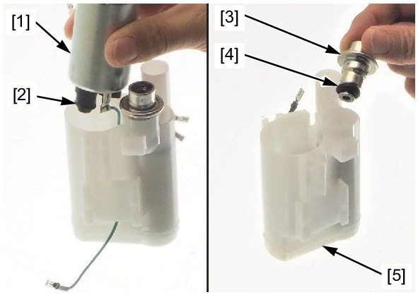

# Fuel - Pump Disassembly

Источник: `Fuel - Pump Disassembly.pdf`

DISASSEMBLY/INSPECTION 
Disconnect the following: 
* Yellow wire connector [1] 
* Green wire connector [2] 
* White wire connector [3] 
* Black wire connector [4] 
Release the tabs [5]. 
Remove the fuel filter unit [1] and O-ring [2] from the flange [3]. 

Remove the fuel pump [1] and O-ring [2]. 
Visually inspect the suction filter for dirt, debris, or any clogging. 
Replace fuel pump unit as an assembly if the suction filter is abnormal. 
Remove the pressure regulator [3] and O-ring [4] from the fuel filter [5]. 

