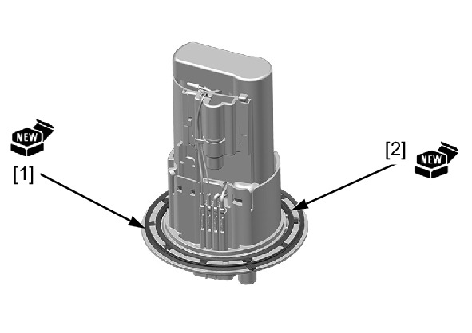
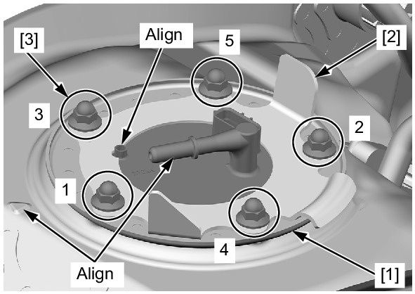

# Fuel - Pump Install

Источник: `Fuel - Pump Install.pdf`

INSTALLATION 
Install new dust seal [1] and fuel pump gasket [2] into the fuel pump unit properly. 

NOTE: 
* Always replace the packing with a new one. 
* Be careful not to pinch any dirt or debris between the fuel pump unit and packing. 
Install the fuel pump unit [1] and set plate [2] as shown. 
Install the fuel pump mounting nuts [3] and tighten them to the specified torque in the sequence as shown. 
TORQUE: 12 N·m (1.2 kgf·m, 9 lbf·ft) 
Install the fuel tank . 

