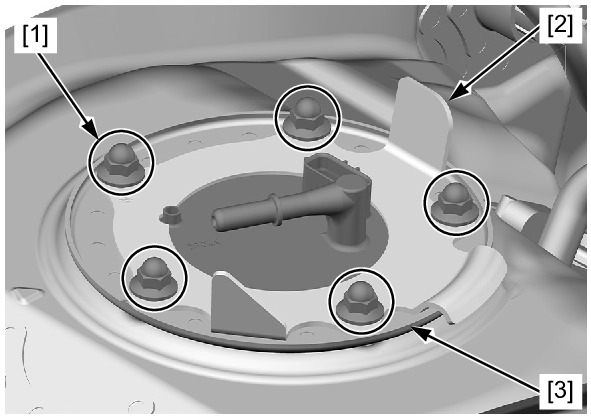
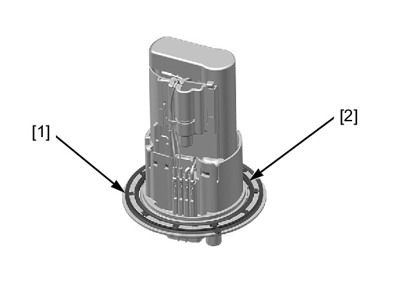

# Fuel - Pump Removal

Источник: `Fuel - Pump Removal.pdf`

REMOVAL 
Remove the fuel tank . 
Clean around the fuel pump unit. 
Loosen the fuel pump unit mounting 
nuts [1] in a crisscross pattern in 2 or 3 
steps. 
Remove the fuel pump unit mounting 
nuts. 
Remove the set plate [2] and fuel 
pump unit [3]. 

Remove the dust seal [1] and fuel 
pump gasket [2] from the fuel pump 
unit. 

