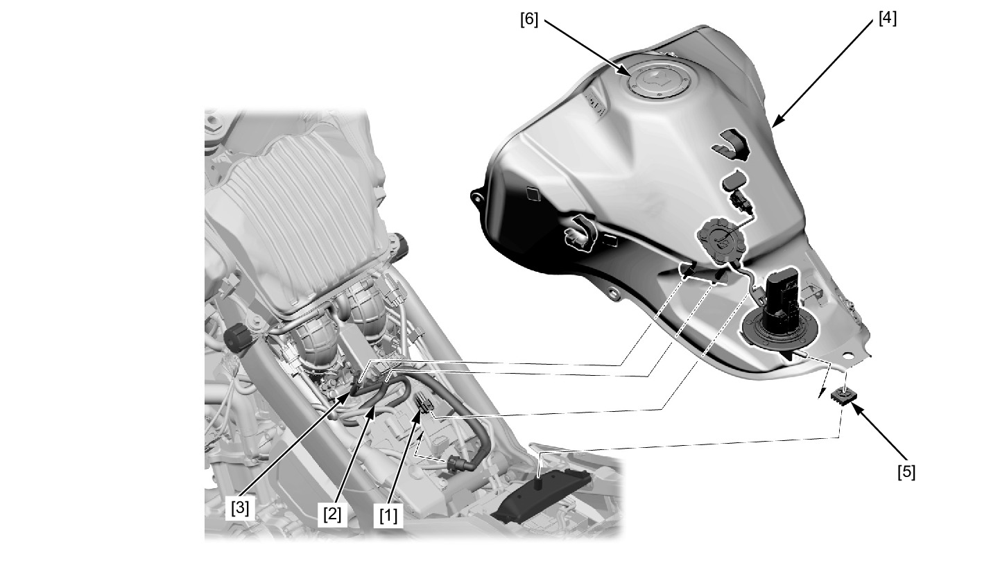
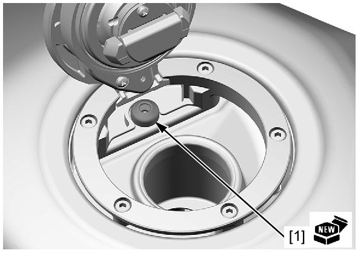

# Fuel - Tank

Источник: `Fuel - Tank.pdf`

REMOVAL/INSTALLATION 
Disconnect the quick connect fitting (fuel pump side) . 
Disconnect the following: 
* Fuel level sensor 2P (Black) connector [1] 
* Fuel tank drain hose [2] 
* Fuel tank breather hose [3] 
Remove the fuel tank [4]. 
Remove the grommet [5] from the fuel tank. 
Remove the fuel filler cap [6] by removing the fuel filler cap bolts, if necessary. 

Installation is in the reverse order of removal. 
TORQUE: 
Fuel filler cap bolt: 
1.8 N·m (0.18 kgf·m, 1.3 lbf·ft) 

NOTE: 
* A pressure release can be heard when opening the fuel cap, but this is not blockage of the passage. If checking for clog in the passage of 
the fuel tank side is necessary, apply air pressure to the breather hose end with the fuel filler cap opened. 
* If the fuel filler cap was removed, replace the breather seal [1] with a new one. 
* Route the hoses, wires and harness properly . 
Connect the quick connect fitting (fuel pump side) . 

