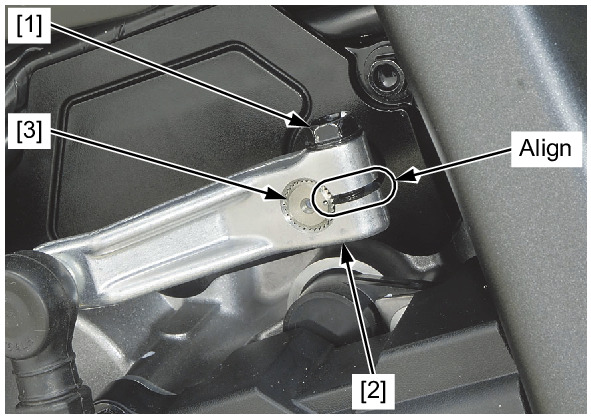
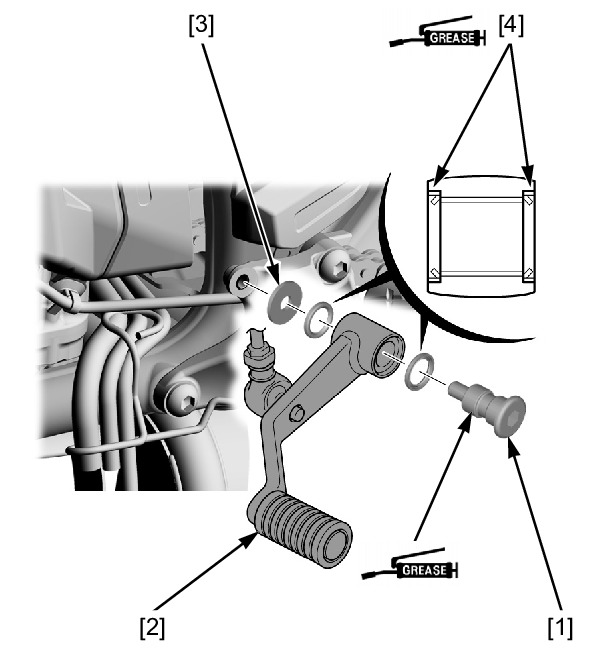
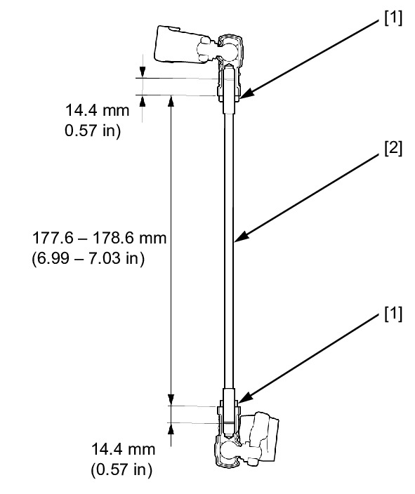

# Gearshift Arm&Pedal

Источник: `Gearshift Arm&Pedal.pdf`

REMOVAL/INSTALLATION 
Remove the pinch bolt [1] and gearshift arm [2] from the 
gearshift spindle [3]. 
Remove the gearshift pedal pivot bolt [1]. 
Remove the gearshift pedal [2] and washer [3]. 
Remove the dust seals [4]. 
Check the dust seals and tie-rod ball joint dust cover for 
deterioration or damage, replace them if necessary. 
Installation is in the reverse order of removal. 
TORQUE: 

Gearshift pedal pivot bolt: 
27 N·m (2.8 kgf·m, 20 lbf·ft) 

NOTE: 
* Apply grease to the dust seal lips. 
* Install the dust seals with the seal lip side facing out. 
* Apply grease to the gearshift pedal pivot sliding area 
(grease groove) of the pivot bolt. 
* Align the slit of the gearshift arm with the punch 
mark on the spindle. 
When adjusting the gearshift pedal height, perform the 
procedure as follows: 
Loosen the lock nuts [1]. 

NOTE: 

* The gearshift arm side lock nut has left hand 
threads. 
Adjust the tie-rod [2] length so that the distance between 
the ball joint ends is standard length as shown. 
After adjustment, tighten the lock nuts securely. 

