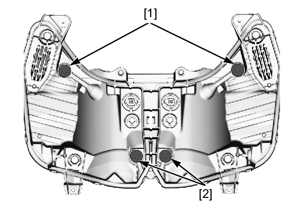

# Headlight Aim

Источник: `Headlight Aim.pdf`

HEADLIGHT AIM 
Place the motorcycle on a level surface. 
Adjust the headlight aim vertically by turning the 
vertical beam adjusting screw [1]. 
Adjust horizontally by turning the horizontal adjusting 
screws [2]. 

NOTE: 
l Adjust the headlight beam as specified by local 
laws and regulations. 
Page 1 of 1
30/07/2023
