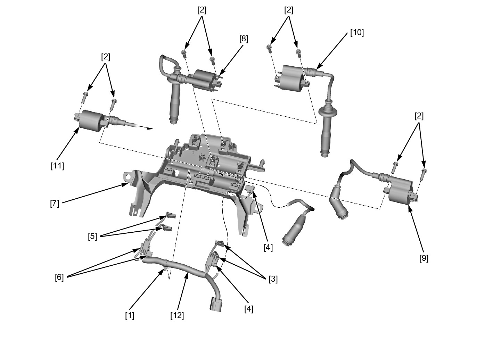
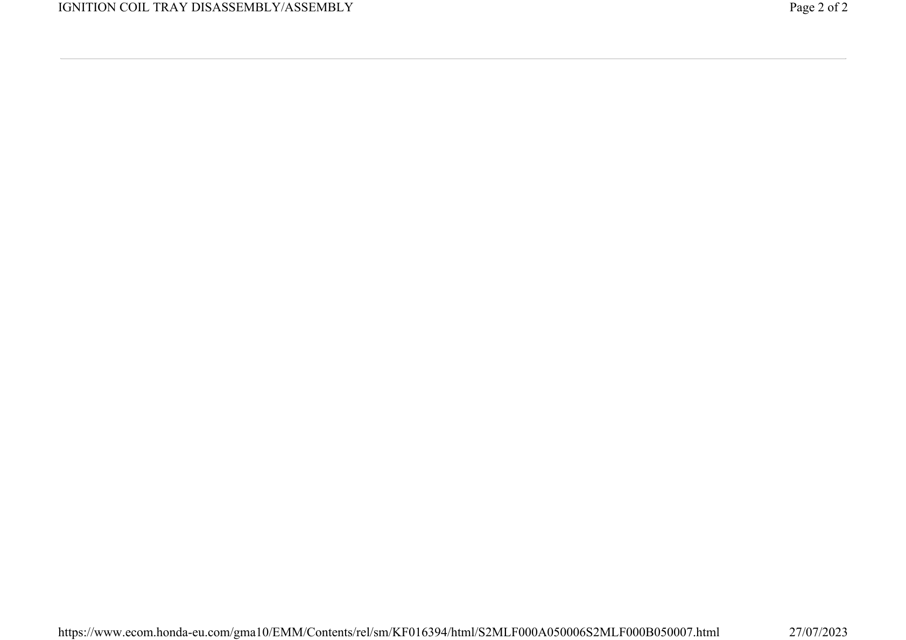

# Ignition Coil Tray Assembly

Источник: `Ignition Coil Tray Assembly.pdf`

IGNITION COIL TRAY DISASSEMBLY/ASSEMBLY 
Remove the ignition coil tray assembly . 
Release the wire clip [1]. 
Remove the bolts [2]. 
Disconnect the following: 
* No.1-1 ignition coil connectors [3] 
* No.1-2 ignition coil connectors [4] 
* No.2-1 ignition coil connectors [5] 
* No.2-2 ignition coil connectors [6] 
Remove the following parts from the ignition tray [7]: 
* No.1-1 ignition coil [8] 
* No.1-2 ignition coil [9] 
* No.2-1 ignition coil [10] 
* No.2-2 ignition coil [11] 
* Ignition sub harness [12] 
Installation is in the reverse order of removal. 

NOTE: 
* Route the wire harness properly . 

