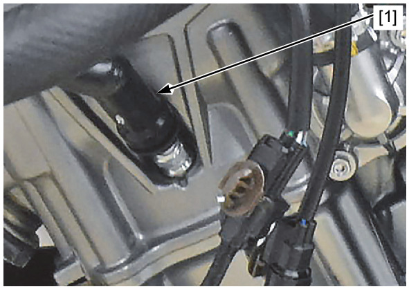
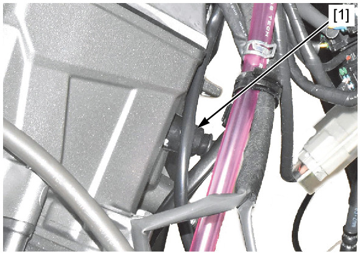
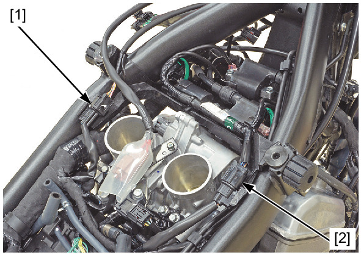
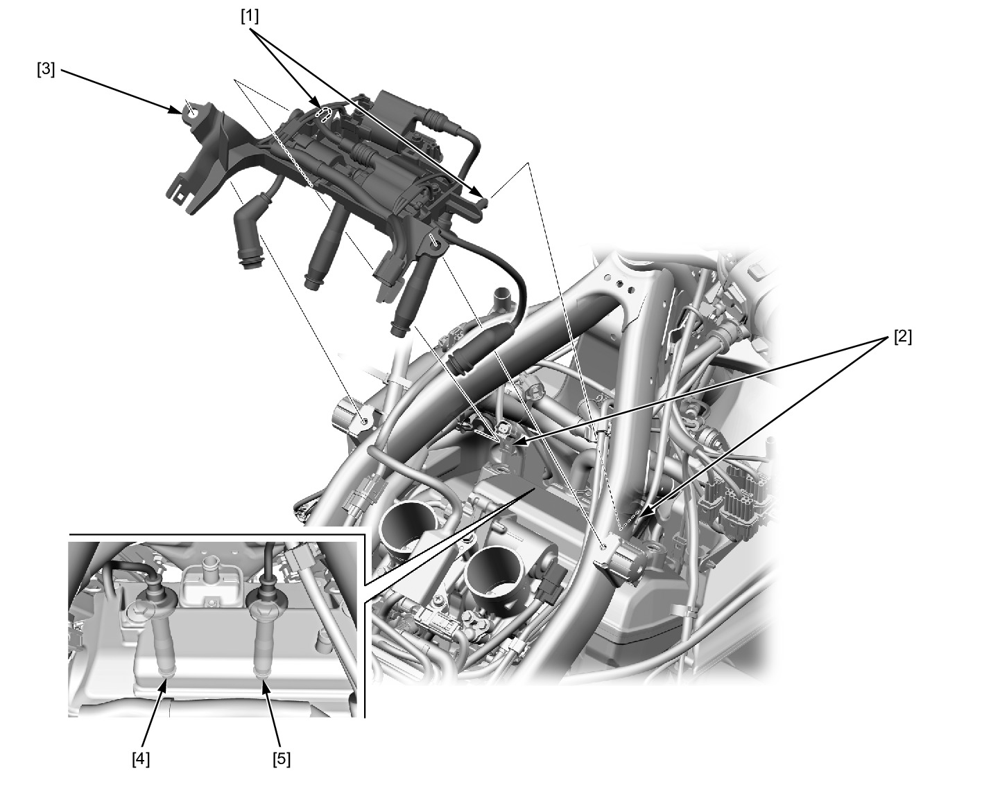

# Ignition Coil Tray

Источник: `Ignition Coil Tray.pdf`

IGNITION COIL TRAY REMOVAL/INSTALLATION 
Remove the Following: 
* Radiator 
* PAIR control solenoid valve stay 
Disconnect the No.1-2 spark plug cap [1]. 
Disconnect the No.2-2 spark plug cap [1]. 
Release the immobilizer receiver 4P (Black) connector [1]. 
Disconnect the ignition sub harness 6P connector [2]. 

Release the bosses [1] from the grommets [2] by pulling the ignition coil tray assembly [3] rearward. 
Disconnect the No.1-1 spark plug cap [4] and No.2-1 spark plug cap [5]. 
Remove the ignition coil tray assembly. 
Installation is in the reverse order of removal. 

NOTE: 
* Route the wires properly . 

