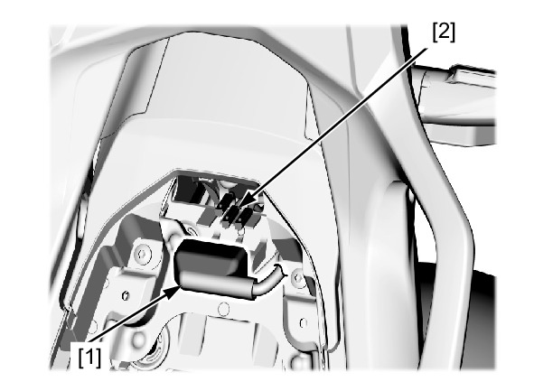
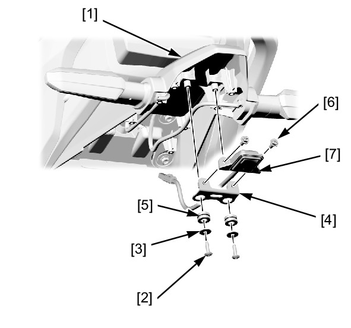

# Lights - License Plate

Источник: `Lights - License Plate.pdf`

REMOVAL/INSTALLATION 
Remove the following: 
* Pillion seat 
* Rear fender A 
Release the connector cover [1] from the stay. 
Disconnect the license light 2P (White) connector [2]. 

Remove the following from the rear fender A stay [1]: 
* Screws [2] 
* Washers [3] 
* Stay [4] 
* Grommets [5] 
* License light bolts [6] 
* License light [7] 
Installation is in the reverse order of removal. 
TORQUE: 
License light bolt: 
2.0 N·m (0.20 kgf·m, 1.5 lbf·ft) 

