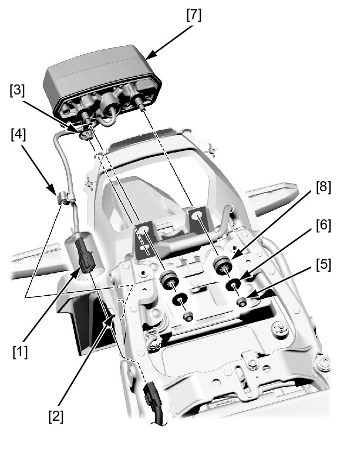

# Lights-Brake&Taillight

Источник: `Lights-Brake&Taillight.pdf`

REMOVAL/INSTALLATION 
Remove the rear center cowl . 
Disconnect the brake/taillight 3P (Black) connector [1]. 
Release the following from the rear fender B [2]: 
* Brake/taillight harness band clip A [3] 
* Brake/taillight harness band clip B [4] 
Remove the following: 
* Nuts [5] 
* Washers [6] 
* Brake/taillight unit [7] 
* Grommets [8] 
Installation is in the reverse order of removal. 

