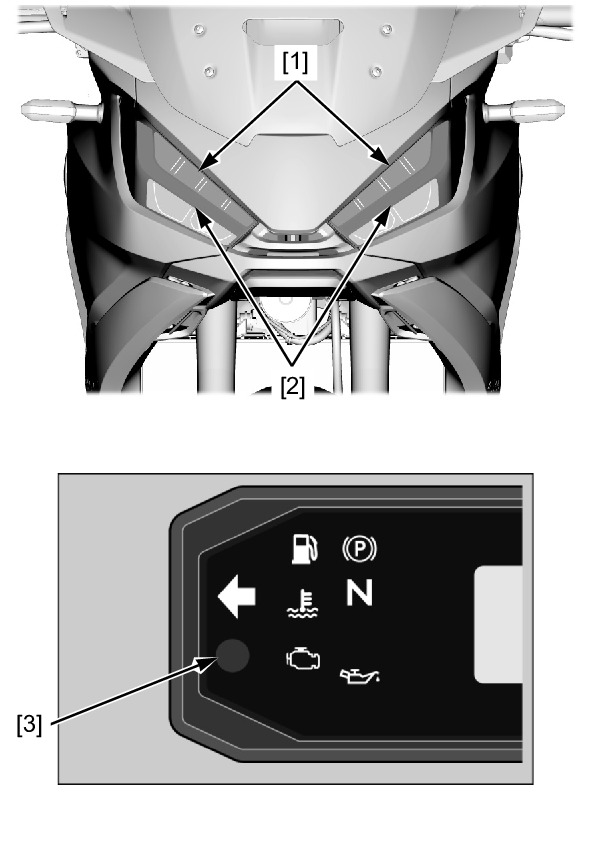
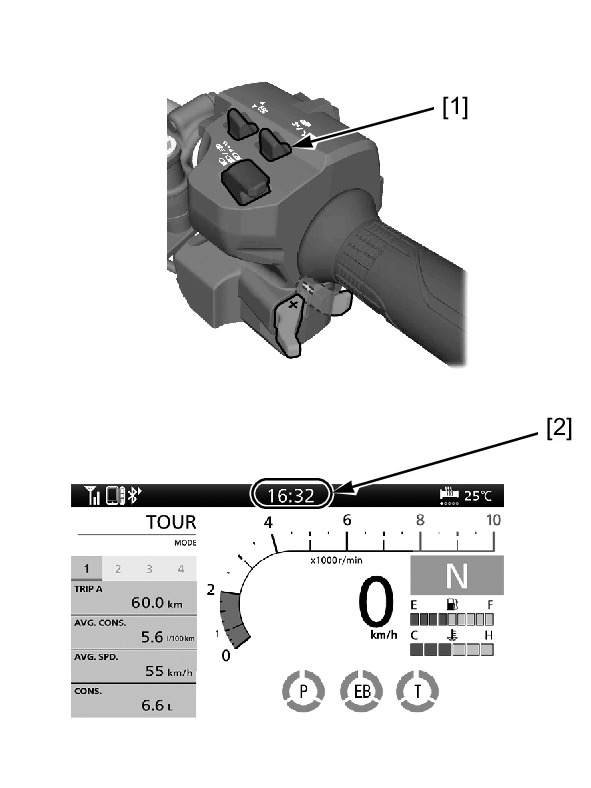
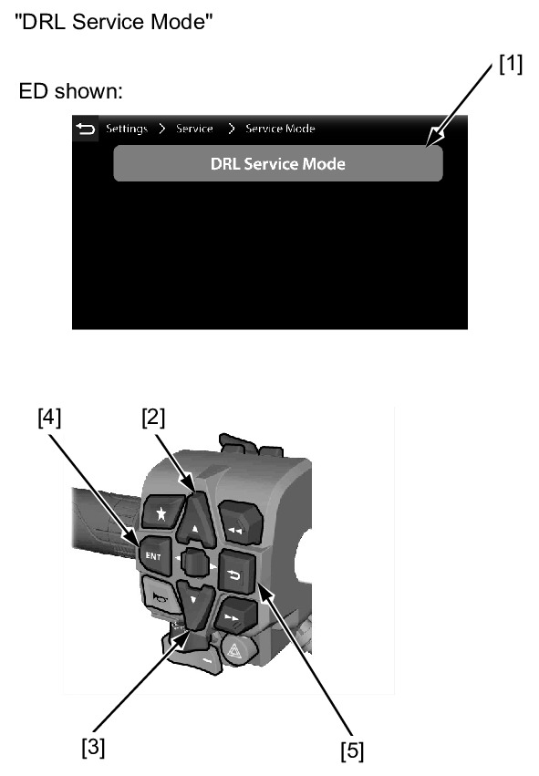

# Lights-Headlight Inspection

Источник: `Lights-Headlight Inspection.pdf`

INSPECTION 
Check the following before inspection: 
* Battery condition 
* Blown sub fuse HEAD LIGHT 15 A 
* Blown sub fuse HORN/STOP 10 A 
* DTC indicated 
Check the following lighting condition: 
* Headlight [1] 
* DRL [2] 

NOTE: 
* If any LED in the headlight unit does not turn on, replace the headlight unit as an assembly. 
* When the headlight or DRL does not light properly, check the following: 
◦No DTC in the ABS system 
◦Headlight power/ground line 
◦Faulty circuit between the headlight unit and BCU 
◦Photosensor [3] (in the meter) for damage or cover 
* When the headlight dimmer/passing light control switch is turned to DRL auto or off (low beam), the headlights and DRL 
are switched automatically according to the ambient brightness. 
When it gets brighter, DRL lights up, and when it gets dark, low beam lights up and DRL decreases to the brightness of 
the position light. 

DRL FORCIBLY ACTIVATE 
To forcibly activate the DRLs lights, perform the procedure as follows: 
1. Pull and hold the page switch [1] or touch the clock area [2] of the MID. 

2. Select the "DRL Service Mode" [1] by using the sel up switch [2], sel down switch [3], ENT switch [4] 
and back switch [5] or touch the MID. 

NOTE: 
* Select the display in the following order to the "DRL Service Mode" : 
"Settings" > "Service" > "Service Mode" > "DRL Service Mode" 
3. Check the each lights are lighting. 

