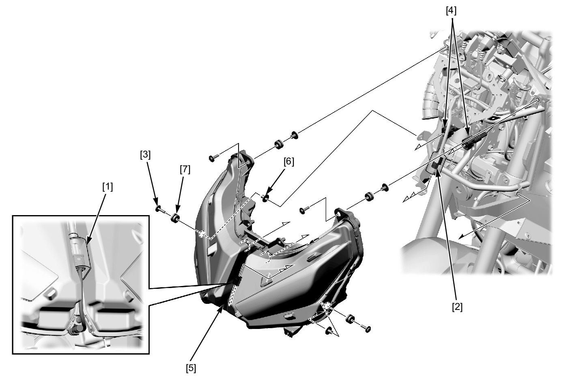
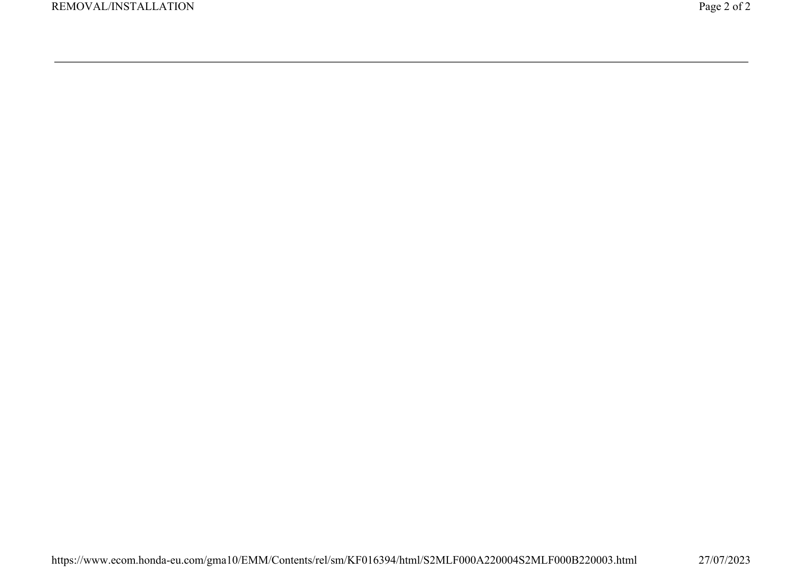

# Lights-Headlight

Источник: `Lights-Headlight.pdf`

REMOVAL/INSTALLATION 
Remove the front cowl . 
Release the open air temperature connector cover [1] from the headlight unit. 
Disconnect the open air temperature sensor 2P (Black) connector [2]. 
Remove the bolts [3]. 
Disconnect the headlight 6P (Black) connectors [4]. 
Remove the headlight unit [5]. 
Remove the collars [6] and grommets [7] from the headlight unit. 
Installation is in the reverse order of removal. 

NOTE: 
* Route the wires properly . 
* Put the open air temperature sensor connector cover to the center groove on the headlight unit when installing. 

