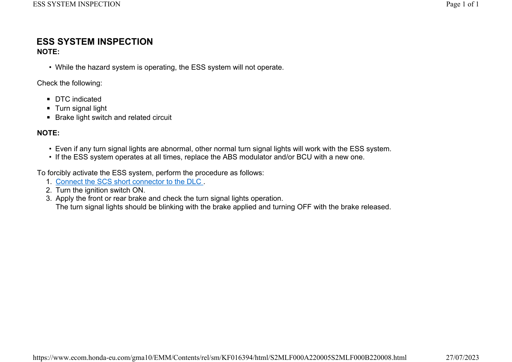

# Lights-Turn Signals ESS

Источник: `Lights-Turn Signals ESS.pdf`

ESS SYSTEM INSPECTION 

NOTE: 
* While the hazard system is operating, the ESS system will not operate. 
Check the following: 
* DTC indicated 
* Turn signal light 
* Brake light switch and related circuit 

NOTE: 
* Even if any turn signal lights are abnormal, other normal turn signal lights will work with the ESS system. 
* If the ESS system operates at all times, replace the ABS modulator and/or BCU with a new one. 
To forcibly activate the ESS system, perform the procedure as follows: 
1. Connect the SCS short connector to the DLC . 
2. Turn the ignition switch ON. 
3. Apply the front or rear brake and check the turn signal lights operation. 
The turn signal lights should be blinking with the brake applied and turning OFF with the brake released. 

