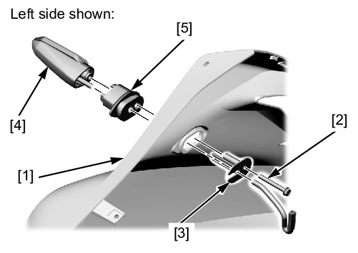
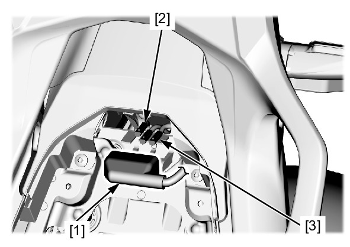
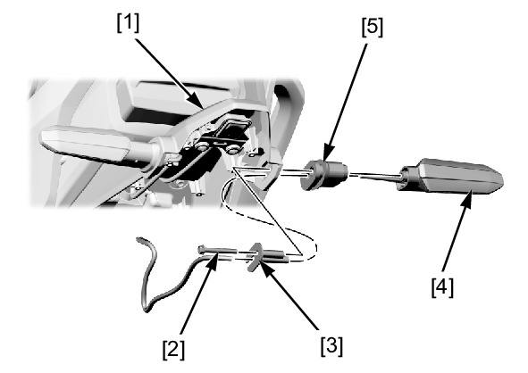

# Lights-Turn Signals

Источник: `Lights-Turn Signals.pdf`

TURN SIGNAL LIGHT REMOVAL/INSTALLATION 
FRONT 
Remove the middle cowl . 
Remove the following from the middle cowl [1]: 
* Bolt/washer [2] 
* Collar [3] 
* Turn signal light [4] 
* Grommet [5] 
Installation is in the reverse order of removal. 
REAR 
Remove the following: 
* Pillion seat 
* Rear fender A 
Release the connector cover [1] from the stay. 
Disconnect the turn signal light 2P connector: 
* Right: light blue [2] 
* Left: orange [3] 

Remove the following from the rear fender A stay [1]: 
* Bolt/washer [2] 
* Collar [3] 
* Turn signal light [4] 
* Grommet [5] 
Installation is in the reverse order of removal. 

