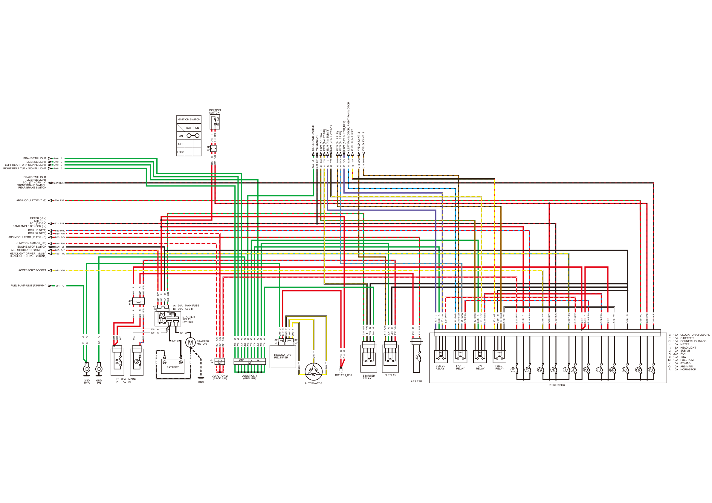
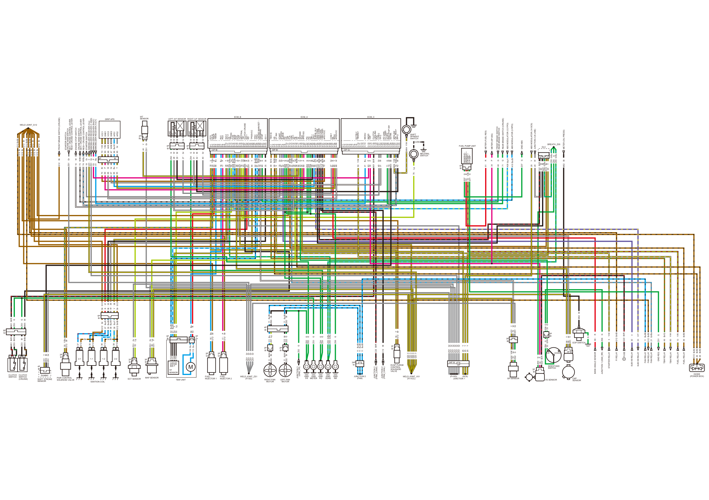
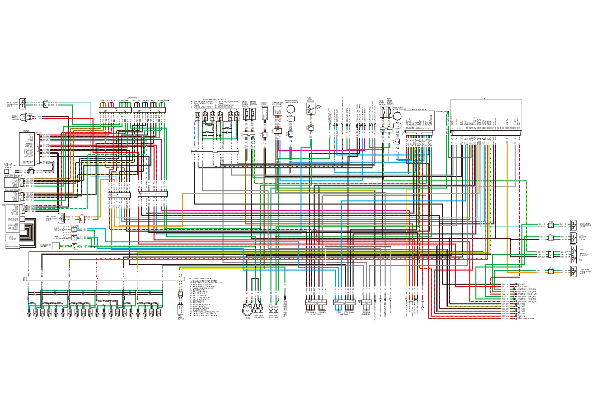

# NT1100 Wiring Diagram

Источник: `NT1100 Wiring Diagram.pdf`

BAT
IG
20A
2P
Br
3P
Gr
3P
Bl
4P
Bl
4P
Bl
E
F
G
H
I
J
K
L
M
N
O
P
B
A
C
D
24P
W
24P
12P
12P
W
Y/R
Br/Bl
Br/Bl
V
G
G
G
G
G
G
G
G
G
G
G
G
R/Y
R
Bl
G/R
R
G
G
G
R
R/Bu
R
R
Bl/Gr
W
W
Bl
Bl
Bl/Gr
R/Bu
R/W
R/W
R/W
R
Y
Y
Y
Y
R
R
Y
Y
G/R
Y/W
Bl
G
Br/Bl
G
Bl
R/Bu
R
R/G
V/Y
R/W
Bu/Bl
Br/Bl
Gr/Bu
R/Bu
Br/G
G
Y/W
Y/R
Bl
W
Br/Bl
R/W
R
R/Bu
Y/W
R/Bl
Bl/R
Y/Bu
R/W
R
R
R/Bu
R/Bu
R
W
Bl
R/G
R/Bl
Bl/R
R/Bu
R
Br/G
Bl/R
G
Y/W
V
Br/Bl
Gr/Bu
V/Y
Y/W
Bu/Bl
R/Bl
R
R/Bl
G
R/W
Bl
Y/Bu
R/Y
Y/W
R/W
R/Bu
R/G
Bl/R
R/G
Bl/R
G
G
G
G
13
G12
G12
32
Z06
Z01
Z06
Z06
Z06
Z06
Z06
Z06
Z06
Z06
Z06
Z06
B15
B16
G24
G25
B11
Z01
Z01
Z06
B13
B12
B11
B11
102
B00
B00
B00
101
102
102
B12
B11
B11
B00
B12
B00
B21
B21
B21
B16
203
201
200
201
B16
B16
200
203
G25
5
G24
Z06
G12
Z06
G24
B12
B13
B25
33
B27
11
G12
21
B23
49
Z06
50
13
G24
B26
39
B21
B16
B22
G21
G11
G22
G23
B27
B11
B11
B23
B24
B11
B26
G24
G26
G11
G27
B24
B16
49
G22
Z06
5
32
39
21
33
50
11
G11
B16
G11
Z01
B21
G24
G23
B15
G21
B21
B22
B25
G22
G26
G27
Z06
Z06
Z06
Z06
BATTERY
GND
REG
GND
PG
E:
15A
CLOCK/TURN/FOG/DRL
F:
10A
G HEATER
G:
10A
CORNER LIGHT/ACC
C:
30A
MAIN2
A:
30A
MAIN FUSE
B:
30A
ABS-M
D:
15A
FI
H:
10A
METER
I:
15A
HEAD LIGHT
J:
10A
SUB VB
K:
20A
FAN
L:
10A
TBW
M:
10A
FUEL PUMP
N:
10A
ST-MAG
O:
10A
ABS MAIN
P:
10A
HORN/STOP
IGNITION
SWITCH
IGNITION SWITCH
STARTER
RELAY
SWITCH
STARTER
MOTOR
ALTERNATOR
REGULATOR/
RECTIFIER
FUEL
RELAY
TBW
RELAY
FAN
RELAY
FI RELAY
SUB VB
RELAY
ABS FSR
STARTER
RELAY
FUEL PUMP UNIT
BAT
ON
ON
OFF
LOCK
LEFT FAN MOTOR, RIGHT FAN MOTOR
BREATH_B16
JUNCTION 1
(GND_RR)
ECM (A-1 TBW+B)
VS SENSOR
SIDESTAND SWITCH
ECM (A-4 ST INH)
ECM (A-8 SUBVB)
ECM (A-12 FLR)
ECM (A-13 FAN)
ECM (A-27 SUBVB_RLY)
ECM (C-10 TBWRLY)
GND
POWER BOX
WELD JOINT_2
WELD JOINT_2
FUEL PUMP UNIT (F/PUMP -)
JUNCTION 2
(BACK_UP)
BCU (39 BAT1)
HEADLIGHT DRIVER 1 (IGN1)
HEADLIGHT DRIVER 2 (IGN1)
JUNCTION 3 (BACK_UP)
ENGINE STOP SWITCH
ACCESSORY SOCKET
METER (IGN)
MID (IGN)
BCU (26 IGN)
BANK ANGLE SENSOR (IN)
ABS MODULATOR (9 MR +B)
RIGHT REAR TURN SIGNAL LIGHT
LICENSE LIGHT
LEFT REAR TURN SIGNAL LIGHT
BRAKE/TAILLIGHT
BRAKE/TAILLIGHT
LICENSE LIGHT
BCU (27 HORN_IN)
FRONT BRAKE SWITCH
REAR BRAKE SWITCH
BCU (13 BAT2)
ABS MODULATOR (18 FSR +B)
ABS MODULATOR (7 IG)

VCC1
GND1
A-1
A-2
A-3
A-4
A-5
A-6
A-7
A-8
A-9
A-10
A-11
A-12
A-13
A-14
A-15
A-16
A-17
A-18
A-19
A-20
A-21
A-22
A-23
A-24
A-25
A-26
A-27
A-28
A-29
A-30
A-31
A-32
A-33
A-34
A-35
A-36
A-37
A-38
A-39
B-1
B-2
B-3
B-4
B-5
B-6
B-7
B-8
B-9
B-10
B-11
B-12
B-13
B-14
B-15
B-16
B-17
B-18
B-19
B-20
B-21
B-22
B-23
B-24
B-25
B-26
B-27
B-28
B-29
B-30
B-31
B-32
B-33
C-1
C-2
C-3
C-4
C-5
C-6
C-7
C-8
C-9
C-10
C-11
C-12
C-13
C-14
C-15
C-16
C-17
C-18
C-19
C-20
C-21
C-22
C-23
C-24
C-25
C-26
C-27
C-28
C-29
C-30
C-31
C-32
C-33
TBW+B
HS
ST INH
START
APS2SG
SUBVB
PG
PG
IGP
FLR
FAN
VH-1
PB
HS
TA
SSTAND
SCS
APS1SG
PG
PG
PG
IPP-1
APS1
SUBVB_RLY
DIAG CANL
DIAG CANH
FRM CANL
FRM CANH
APS1VCC
COM-1
BA
APS2
APS2VCC
TBWRLY
DCTRLY
IMOAU
IMOID
VSP
CLUTCH
LSOLINH
POIL
COM-2
VH-2
PT CANH
PT CANL
STOP2
ENG STOP SW
SSTRK
SPDLSW
CR _RES/+
IPP-2
PCS
EX-AI
TMOP
TMOM
INJ1
INJ2
IG2-2
IG1-2
LG
TPSSG
FVW
RVW
PCP
PCM
VCC
NEUTRAL
TW
CLUTCH CRUISE
IG2-1
SG
TPSSVCC
TPS1
TPS2
DRUMANG
STOP
IG1-1
VCC2
GND2
APS1
APS2
GND
HT
LAF
SG
GND
HT
LAF
SG
2-1
1-1
1-2
2-2
TPS1
TPS2
VCC
SG
8P
Gr
8P
Bl
33P Bl
39P Bl
33P Gr
4P
Bl
4P
Bl
2P
Bu
5P
Bl
6P
R
3P Bl
3P
Bl
3P
Bl
2P
Bl
2P
Bl
24P
W
2P
Gr
2P
Gr
2P
Gr
6P
Bl
6P
Bl
3P
Bl
2P
Bl
2P
Bl
4P
Bl
2P
Bl
4P
Bl
2P
Bl
12P
24P W
CRUISE MAIN/SET -
TP
SENSOR
RESERVE -
RESERVE +
F/PUMP +
F/PUMP -
FUEL PUMP UNIT
Y/R
Y/Bl
W/R
W/Bl
Bu/W
Gr
Lg
Y/W
G
R
Y/R
G
P
G
G
Bu/Y
Bu/Bl
Y
W
Bl/R
W
Bl
G/Bu
Br
Y
G/Bu
G
G/Bu
Bl
V
Y
W
G
G
G
G
P
Bl/R
Y
W
Gr
Gr
Gr
Gr
Gr
Gr
Gr
Gr
Gr
Gr
Gr
Y
Y
Y
Bu/Bl
Bu/Bl
Bu/Bl
Bl/R
G
Y
Bu
Bu
Bu
Br
P
Bu/Bl
Bu/W
Y
Gr
Lg
Gr
Lg
Bl/W
Bl
Bu
Y
Bl
Gr
Lg
Bl/W
Bl
Bl
G
Bu/Bl
Bl
Bu/Bl
Bl
Y
Br
R
Bl
W
Y
Br
Br
Bu/R
Bu/Bl
Bu/W
Bu/Y
Br/Bl
Lg
Bu
R
Br
G
G
G
G
G/Bu
G/Bu
G
G
Br
YY
YYY
Y
Bl
Y/R
W
G
G/W
Y
Y/W
G
R
G
Bl
Br/Bl
Bl/R
V/Y
Bu/Bl
Br/Bl
Gr/Bu
Br/G
G
Y/W
Y/R
Br/Bl
Br/Bl
Br/Bl
Br/Bl
Br
P
W
Gr
Bu
Y
Y
W
W
Bl
Gr
G
W
Bl
Gr
G
W
Bl
Gr
W
W
Y
Y/Bu
R
Bu
Bu
P
Y
W
G/Bu
Lg
Bu/Y
Bu/Bl
Y
W
Y
Lg
Lg
R
Bl
Gr
Y
Bu/Bl
Bu/W
W/Bl
W
G
Bl
Br/G
Br/Bl
Y/W
Gr
Gr
V
G
G
Br
Br/Bl
Gr/Bu
W
Lg
Br/Bl
Y
G
Y
P
G
G
G
Bl
Bu
V/Y
Bl
Bl/R
Bl
Bl/R
Br
Gr
R
Y
W
Y/W
Bu
P
P
Gr
W
Bl/R
G
W
W/Bu
Y/W
Bl
Bl
Bl
Gr
Gr
P
Bu
Gr
Gr
Br
W/Bl
W/Bu
Gr
W
Br/Bl
Br
Br
Br
Br
Br
Br
Br/Bl
Br
Br/Bl
Br
Br
R
Bl/R
G
Bl/R
Bl/G
G
Bl
Bl
Bl/Br
Y/Bu
Br
Br/Bl
Br
Y
70
69
68
67
66
65
76
M04
Z09
Z07
G
Z07
61
13
Z01
34
60
71
A09
A10
25
20
C41
20
C31
Z05
G12
25
Z05
Z05
Z05
M02
32
58
59
Z06
23
Z06
Z05
34
G22
V01
75
ZS1
ZS1
ZS1
ZS1
ZS1
ZS1
ZS1
ZS1
ZS1
ZS1
ZS1
25
25
25
11
11
11
C22
Z02
18
16
113
109
G12
17
52
51
54
ZS1
45
ZS1
43
11
Z02
111
V01
M03
ZS1
Z21
11
Z02
112
Z22
11
Z02
11
Z02
V01
G12
37
35
36
38
G12
G12
37
35
36
38
G12
55
112
111
108
110
56
53
G12
Z02
Z02
Z03
Z04
Z05
Z05
Z04
Z08
G12
V01
V01
V01
V01
V01
V01
C12
V02
75
ZS2
23
V01
5
Z06
80
M02
G12
G22
33
11
G12
21
49
Z01
50
13
39
G12
26
26
70
69
68
67
66
65
44
Z02
28
29
27
Z04
31
42
40
18
30
53
56
16
17
38
36
Z05
55
A09
A10
58
59
V01
43
76
37
M05
ZS1
54
52
51
73
75
60
35
49
26
5
19
67
32
Z04
Z08
G12
39
21
28
45
26
44
23
25
69
Z04
Z04
Z08
29
66
33
C31
C41
C12
C22
70
27
80
65
68
50
41
63
34
40
31
M01
71
10
74
M04
42
M03
ZS1
63
41
ZS1
ZS1
G12
73
74
19
10
G12
G12
G12
G12
G12
G12
G12
G12
G12
G12
G12
G12
61
M01
Z03
M01
Z03
Z03
M05
Z03
M05
30
G12
37
G12
35
G12
36
G12
38
G12
V01
DLC
DUMMY
CKP
SENSOR
TBW UNIT
GND
FR
GND
METER
GND
PG
GND
SENS
BREATH_Z05
CLUTCH
SWITCH
CLUTCH
SWITCH
(CRUISE)
FUEL
INJECTOR 2
FUEL
INJECTOR 1
MAP SENSOR
IGNITION COIL
ECT SENSOR
EVAP PURGE
CONTROL 
SOLENOID
VALVE
RIGHT FAN 
MOTOR
LEFT FAN 
MOTOR
PAIR CONTROL
SOLENOID VALVE
SHIFT STROKE
SENSOR
VS SENSOR
GP SENSOR
SIDESTAND
SWITCH
FUEL RELAY
FUEL RELAY
TBW RELAY
TBW RELAY
GND REG
FAN RELAY
FAN RELAY
FAN RELAY
FI RELAY
SUB VB RELAY
SUB VB RELAY
STARTER RELAY
EOP SWITCH
NEUTRAL
SWITCH
IAT
SENSOR
LEFT A/F SENSOR RIGHT A/F SENSOR
ECM_B
ECM_A
ECM_C
GRIP APS
WELD JOINT_G12
JUNCTION 2
(FRM_CANH)
JUNCTION 3
(GND_FR)
WELD JOINT_V01
(FI-VCC)
JUNCTION 2
(FRM_CANL)
REAR BRAKE SWITCH (CRUISE)
ABS MODULATOR (12 FPO)
ABS MODULATOR (3 RPO)
METER (FUEL RES)
METER (SP-SIG)
GND ABS
METER (OIL PRESS)
H FUSE
(SCS)
JUNCTION 2
(FAN)
(FI-SG)
JUNCTION 1
ABS MODULATOR (14 SCS)
JUNCTION 2 (K-LINE)
FRONT BRAKE SWITCH
REAR BRAKE SWITCH
GND
RR
SHIFT
SPINDLE
SWITCH
ENGINE STOP SWITCH
IMMOBILIZER RECEIVER (1 GND)
FRONT BRAKE SWITCH (CRUISE)
RES/+ CRUISE CONTROL LEVER
STARTER SWITCH
IMMOBILIZER RECEIVER (TxCT)
IMMOBILIZER RECEIVER (RxDT)
JUNCTION 1 (GND_RR)
BANK ANGLE SENSOR
CRUISE MAIN SWITCH
SET/- CRUISE CONTROL LEVER
STARTER SWITCH
CRUISE MAIN SWITCH
SET/- CRUISE CONTROL LEVER
RES/+ CRUISE CONTROL LEVER
IMMOBILIZER RECEIVER (Vcc)
WELD JOINT_ZS1
(FI-SG)
DIODE
(POWER BOX)

PO
BATT
IGN
GND
GND
18
17
16
15
14
13
12
11
10
9
8
7
6
5
4
3
2
1
1
2
3
4
5
6
7
8
9
10
11
12
13
14
15
16
17
18
19
20
21
22
23
24
25
26
27
28
29
30
31
32
33
34
35
36
37
38
39
FSR +B
FVWS
MODE IND
RVWS
SCS
IND
FPO
CAN-L
GND
MR +B
FVWB
IG
RVWB
DIAG
BLS
RPO
CAN-H
MOTOR GND
HORN-OUT
SW1
H/L-LO
GH
SW7
FOG
SG
DRL
LG
BAT2
F-CAN-HI
F-CAN-LO
W/L-FR
W/L-FL
W/L-RR
SW2
H/L-HI
SW5
SW4
SW6
SW3
IGN
HORN-IN
W/L-RL
K-LINE
ANS-BACK
BAT1
Vcc
RxDT
TxCT
SP-SIG
ABS
PARKING
FUEL UNIT
FUEL RES
ALARM
NOT USE
OIL PRESS
AIR TEMP (+)
AIR TEMP (-)
DRL
LO
HI
IGN 1
GND
BATT
IGN
GND
F-CAN H
F-CAN L
NOT USE
NOT USE
F-CAN-1 (H)
F-CAN-1 (L)
F-CAN-2 (H)
F-CAN-2 (L)
2P Lb
20P Gr
2P Bl
12P
Bl
12P
Bl
2P O
2P Bl
2P Bl
12P
Bl
6P
Bl
PO
DRL
LO
HI
IGN 1
GND
6P
Bl
7P Gr
12P Bl
8P
Gr
2P
Bl
4P
Bl
2P
Bl
2P
Bl
2P
Bl
4P Bl
+
-
18P
Bl
39P
Bl
2P Lb
2P
2P O
3P Bl
+
-
1
2
3
4
5
6
7
8
9
1
2
3
4
5
6
10
11
12
13
14
15
16
17
18
19
20
GND
HEATER_R
24P
12P
W
24P
12P
W
24P
W
12P
GND
HEATER_L
2P
2P Bl
GND
USB 1 DATA-
VBUS
USB 1 DATA+
SHIELD
GPS SIGNAL
SHIELD/GND
USB 
SOCKET
GPS ANTENNA
24P
12P
W
24P
12P
W
IN
OUT
2P Bl
Lb
G
Lb
G
R/W
Bl/R
G/W
P
W/Bu
R/Bu
R/Bl
Bl/R
Bl
Bl/R
Bl
Bl
Bl
Bl
Bl/W
W/Bl
W
Bu
W/Bl
W/Bl
Br
W/R
Bl
Lg
Gr
G
R/W
Bl/Y
O
Lb
Bl/Br
Bl/Bu
Br/W
Bl/R
Bl
Bl/R
R
W/Bu
Bl
R/Bl
R/Bu
P
G/W
G
Bu/W
W/Bl
W
G/Bu
Bl
Bl
R/Bu
G
Bu
G
Bl
Br
Br/G
Bl/R
G
W
G
W
R/G
W
W
Y
W/Bu
Bu/Y
Bl
G
R/Y
Bu
R/G
Bu
W
G/Y
Bu/Bl
Bl/R
G
G/Bu
G/Bu
Bl
Bl
Bu
Gr
Br
G/Bu
R/Bu
Bl/R
Bl
Lb
O
Lb
W
Bu
W/R
Br
Lg
W/Bl
Bl/R
Bl/R
O
W
R/W
Bl
Gr
Gr
Y
Bl/R
Bl/R
Bl/R
Bl/R
R/Y
R/G
G
Bl
G
G/Bu
G
G
W
W
W
Bu
Bu
Bu
Gr
Gr
Gr
Bl
Bl
Bl
Bl
W
G
Y
R/Bu
R/W
G
R/W
G
G
Bl
R
G
Y/W
Bl/R
Y/Bu
R/G
Br
R
Bl
P
Bl/R
Gr
W
Bu
W
Bu
Bl/Br
Br
W
Y
Bl
G/O
Y/R
P
W
Bu
Bu/Y
G
Bu/Bl
W/Bl
G
Gr
Bl
Bl/R
Bu
P
G
W
W/Bu
W
Bu
O/Bu
Gr
Y
P
Bu
Bl/R
Bl/Br
G/Y
G/Y
Bu
Bl
W/Bu
G/Bl
Bl
Gr
W/Bl
W/Bu
Gr
Gr
Gr
W
R
Bl/R
W/Bu
Bl
R
Bu
P
G
G
Bl/R
Bl
R/W
Y/Bu
O
Lb
W
Bu
Br
Y
Bl
Bl
W/Bl
Bl/W
Br/W
Bl/Bu
Bl/Y
G
R/W
Bl/R
G/W
Bl/R
Bl
G
Lb
G
Bl/R
G
O
G/Y
G
Bl/R
G/Y
G
Bl
G
Br
G
Lb
O
G
Bu
G
Bu
G
O
G
G/Bu
W/Y
W/G
W/R
W/Bu
G
O
Bl
Bl
Y/R
G
Bl
Bl
Y/W
G
Lg/Bl
G
Bl/Br
Br/W
Bl/Bu
Bl/Y
G
Bl/Br
Bl/G
G/W
G/W
G/W
Bl/Br
Bl/Br
Bl/Br
Bl/Bu
Bl/Bu
Bl/Bu
Bl/Y
Bl/Y
Bl/Y
G
G
G
G
G
R/W
R/W
R/W
Br/W
Br/W
Br/W
Bl/R
R
W07
Z02
W07
Z02
B21
G22
Z03
34
A02
64
61
C21
C11
C29
C19
M02
60
59
60
59
F08
F08
F13
F13
F09
F12
F10
F11
ZS3
Z02
B21
G23
W06
W07
F01
F02
F03
C21
C11
G22
80
A02
M02
61
64
34
Z03
Z02
G24
73
74
ZS3
G12
72
64
Z03
64
Z03
G27
60
72
71
G27
60
72
71
A06
B25
A03
A06
25
A02
A09
C13
Z07
B15
A04
G26
A05
20
60
A10
C23
Z07
Z05
Z05
H02
F10
57
ZS3
F03
Z05
B22
C28
C18
W07
W06
W03
F08
F02
F12
F09
F11
F13
G22
G27
W05
20
B21
62
ZS1
ZS1
25
C21
C22
C23
C28
B15
B25
Z02
Z03
Z03
Z05
Z07
Z07
20
20
20
57
57
57
ZS3
ZS3
ZS3
C11
C12
C13
C18
20
Z02
V01
B22
B21
Z06
B21
Z06
Z06
G24
80
Z06
G21
G22
G23
G26 
G12
61
M02
34
G27
F16
F01
A05
A06
A05
G27
G12
72
H03
H02
ZS1
V01
63
A03
A04
A09
Z07
A10
73
60
19
C12
C22
41
63
71
10
74
A03
A04
41
ZS1
V01
63
41
G27
60
60
60
F16
19
10
ZS1
G24
ZS1
73
74
ZS3
F16
19
10
80
G22
A02
M02
61
64
34
Z03
Z02
C21
C11
B21
G23
W06
W07
F01
F02
F03
H03
62
Z03
59
60
F03
F01
F02
G23
Z02
F03
F01
F02
G23
Z02
B21
G22
Z03
C29
C19
Z06
W03
Z06
G27
Z06
W05
Z06
W05
60
Z06
G27
60
Z06
G27
Z06
G27
Z06
W03
W06
Z02
57
Z02
57
Z02
W06
Z02
ZS3
F11
F10
F12
F09
H03
H02
H03
Z02
G21
Z02
Z03
Z03
Z03
F01
F01
F01
F02
F02
F02
G23
G23
G23
Z02
Z02
Z02
Z02
Z02
B21
B21
B21
F03
F03
F03
G22
80
DUMMY
BCU
BRAKE
TAIL
RIGHT FRONT
TURN SIGNAL
LIGHT
RIGHT
FOG LIGHT
DUMMY
LEFT
FOG LIGHT
OPEN AIR
TEMPERATURE
SENSOR
HEADLIGHT DRIVER 1
HEADLIGHT DRIVER 2
LEFT FRONT
TURN SIGNAL
LIGHT
BREATH_Z05
MID
HORN
RIGHT REAR
TURN SIGNAL
LIGHT
LEFT REAR
TURN SIGNAL
LIGHT
LICENSE
LIGHT
12V 5W
BRAKE/
TAILLIGHT
ABS MODULATOR
REAR WHEEL
SPEED SENSOR
FRONT WHEEL
SPEED SENSOR
FUEL
LEVEL
SENSOR
METER
IMMOBILIZER
RECEIVER
REAR
BRAKE
SWITCH
REAR
BRAKE
SWITCH 
(CRUISE)
GND
FR
GND
METER
GND
SENS
GND
ABS
O FUSE
JUNCTION 1 (SCS)
DLC (K-LINE)
RIGHT FAN MOTOR
LEFT FAN MOTOR
JUNCTION 1 (FI-SG)
JUNCTION 1 (FI-SG)
(FRM_CANL)
JUNCTION 2
(K-LINE)
(FOG)
(BCU-SG)
JUNCTION 1
(FRM_CANH)
JUNCTION 2
WELD JOINT_V01 (FI-VCC)
WELD JOINT_G12
VS SENSOR
FUEL PUMP UNIT
ECM (C-31 CR RES/+)
ECM (C-27 ENG STOP SW)
ECM (C-26 STOP2)
ECM (C-15 IMOID)
ECM (C-14 IMOAU)
ECM (B-14FVW)
FUEL PUMP UNIT 
(RESERVE-)
ECM (B-15 RVW)
ECM (A-6 START)
ECM (A-30 FRM CANL)
ECM (A-31 FRM CANH)
ECM (B-29 CRUISE MAIN/SET-)
ECM (B-31 STOP)
RIGHT
GRIP
HEATER
EOP SWITCH
LEFT
GRIP
HEATER
ACCESSORY
SOCKET
PASSING LIGHT CONTROL SWITCH
1:
2:
3:
FUNCTION LEVER UP
4:
FUNCTION LEVER DOWN
5:
VOICE CONTROL SWITCH
6:
PAGE SWITCH
7:
SEL LEFT SWITCH
8:
BACK SWITCH
9:
SEL UP SWITCH
10:
SEL DOWN SWITCH
11:
SEL RIGHT SWITCH
12:
ENT SWITCH
13:
SKIP SWITCH
14:
GOES BACK SWITCH
15:
HORN SWITCH
16:
FAVORITE SWITCH
17:
HAZARD SWITCH
HEADLIGHT DIMMER SWITCH
LEFT HANDLEBAR SWITCH
2.   SET/- CRUISE CONTROL
      LEVER
3.   CRUISE MAIN SWITCH
4.   RES/+ CRUISE CONTROL
      LEVER
5.   FUNCTION SWITCH
6.   STARTER SWITCH
1.   ENGINE STOP SWITCH
RIGHT HANDLEBAR SWITCH
I
FUSE
P FUSE
N FUSE
H FUSE
G FUSE
F FUSE
B FUSE
ABS FSR FUSE (20A)
JUNCTION 1 (GND_RR)
JUNCTION 1 (GND_RR)
ECM (A-37 BA)
JUNCTION 2 (BACK_UP)
JUNCTION 1 (GND_RR)
JUNCTION 1 (GND_RR)
JUNCTION 2 (BACK_UP)
FRONT
BRAKE
SWITCH
FRONT
BRAKE
SWITCH
(CRUISE)
18:
TURN SIGNAL CANCEL SWITCH
19:
TURN SIGNAL LEFT SWITCH
20:
TURN SIGNAL RIGHT SWITCH
(GND_METER)
(GND_FR)
(BACK_UP)
(DRL)
(H/L_LO)
(H/L_HI)
(H/L_15A)
JUNCTION 3
BANK 
ANGLE 
SENSOR
