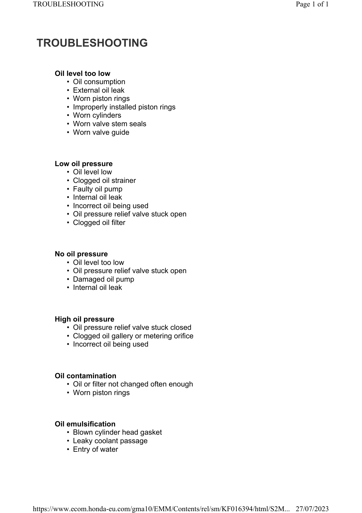

# Oil - Troubleshooting Lubrication

Источник: `Oil - Troubleshooting Lubrication.pdf`

TROUBLESHOOTING 
Oil level too low 
* Oil consumption 
* External oil leak 
* Worn piston rings 
* Improperly installed piston rings 
* Worn cylinders 
* Worn valve stem seals 
* Worn valve guide 
Low oil pressure 
* Oil level low 
* Clogged oil strainer 
* Faulty oil pump 
* Internal oil leak 
* Incorrect oil being used 
* Oil pressure relief valve stuck open 
* Clogged oil filter 
No oil pressure 
* Oil level too low 
* Oil pressure relief valve stuck open 
* Damaged oil pump 
* Internal oil leak 
High oil pressure 
* Oil pressure relief valve stuck closed 
* Clogged oil gallery or metering orifice 
* Incorrect oil being used 
Oil contamination 
* Oil or filter not changed often enough 
* Worn piston rings 
Oil emulsification 
* Blown cylinder head gasket 
* Leaky coolant passage 
* Entry of water 

