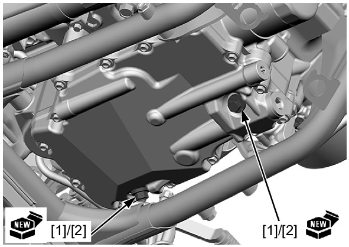

# Oil-Change

Источник: `Oil-Change.pdf`

ENGINE OIL CHANGE 
Remove the under cover . 
Warm up the engine. 
Stop the engine and remove the oil filler cap and dipstick. 
Place an oil pan under the engine to catch the engine oil, 
then remove the engine oil drain bolts [1] and sealing 
washers [2]. 
Drain the engine oil completely. 

NOTE: 
* Be sure to drain the engine oil from both drain holes. 
Clean the drain bolts and install new sealing washers onto 
the drain bolts. 
Install and tighten the drain bolts to the specified torque. 
TORQUE: 30 N·m (3.1 kgf·m, 22 lbf·ft) 
Fill the engine with the recommended engine oil . 
ENGINE OIL CAPACITY: 
MT model: 
3.9 liters (4.1 US qt, 3.4 Imp qt) at draining 
4.0 liters (4.2 US qt, 3.5 Imp qt) at oil filter change 
4.8 liters (5.1 US qt, 4.2 Imp qt) at disassembly 
DCT model: 
4.0 liters (4.2 US qt, 3.5 Imp qt) at draining 
4.2 liters (4.4 US qt, 3.7 Imp qt) at oil filter change 
5.2 liters (5.5 US qt, 4.6 Imp qt) at disassembly 
Check the engine oil level . 
Make sure that there are no oil leaks. 
Install the under cover . 

