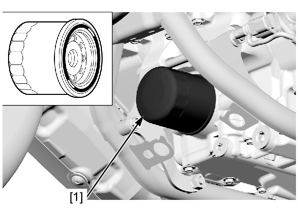
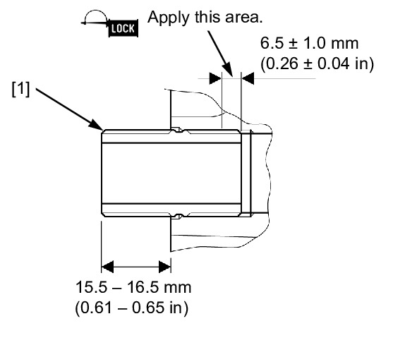
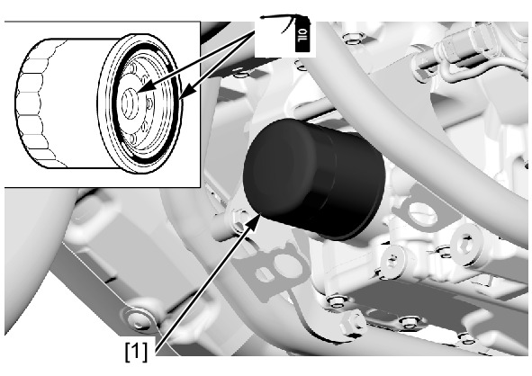

# Oil-Filter

Источник: `Oil-Filter.pdf`

ENGINE OIL FILTER 

NOTE: 
* DCT model: 
Replace the clutch oil filter when the engine oil filter is replaced. 
Drain the engine oil . 
Remove and discard the oil filter cartridge [1] 
using the special tool. 
TOOL: 
Oil filter wrench 
07HAA-
PJ70101 

Check the oil filter boss [1] protrusion from the 
crankcase is within the specified length as 
shown. 
SPECIFIED 
LENGTH: 
15.5 – 16.5 mm (0.61 – 
0.65 in) 

NOTE: 
* If the oil filter boss is removed, apply 
locking agent to the oil filter boss 
threads as shown and install it. 

Clean the oil filter attaching surface of the 
crankcase. 
Apply engine oil to new oil filter cartridge 
threads and O-ring. 
Install and tighten the oil filter cartridge [1] to 
the specified torque using the special tool. 
TOOL: 
Oil filter wrench 
07HAA-
PJ70101 
TORQUE: 26 N·m (2.7 kgf·m, 19 lbf·ft) 
Fill the engine with the recommended engine 
oil and check that there are no oil leaks . 

