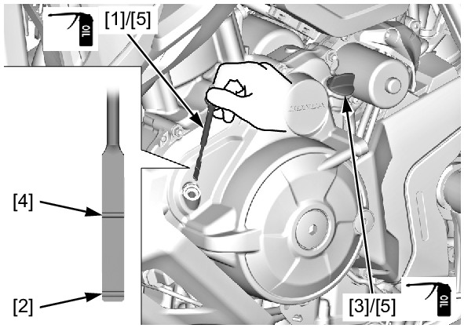

# Oil-Level

Источник: `Oil-Level.pdf`

OIL LEVEL INSPECTION 
Place the motorcycle on its sidestand. 
Start the engine and let it idle for 3 – 5 minutes. 
Stop the engine and wait 2 – 3 minutes. 
Remove the dipstick [1] and wipe it clean. 
Place the motorcycle on a level surface, and 
support it in an upright position. 
Insert the dipstick until it seats, but do not screw it 
in. 
Check that the oil level is between the upper and 
lower level lines on the dipstick. 
If the level is below the lower level line [2], remove 
the oil filler cap [3] and fill the crankcase with the 
recommended oil up to the upper level line [4]. 
RECOMMENDED ENGINE OIL: 
Honda "4-stroke motorcycle oil" or an 
equivalent motor oil. 
API service classification: SJ or higher 
JASO T903 standard: MA 
Viscosity: SAE 10W-30 
Check that the O-rings [5] of the oil filler cap and 
dipstick are in good condition, and replace them if 
necessary. 
Apply engine oil to the O-rings. 
Install the oil filler cap and dipstick. 

