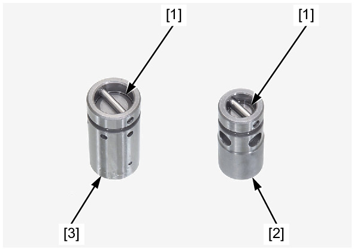

# Oil-Pump Inspection

Источник: `Oil-Pump Inspection.pdf`

INSPECTION 
OIL PUMP 
Inspection the following parts for damage, abnormal wear, deformation, or burning: 
* Oil pump shaft 
* Drive pin 
* Inner rotor 
* Outer rotor 
* Oil pump body 
Measure the oil pump clearances according to LUBRICATION SYSTEM SPECIFICATIONS . 
If any of the measurement is out of the service limit, replace the oil pump as an assembly. 
PRESSURE RELIEF VALVE 
Remove the pressure relief valve . 
Check the operation of the valve by pushing on the piston [1]. 
* Engine oil pressure relief valve [2] 
* DCT oil pressure relief valve (DCT model) [3] 

