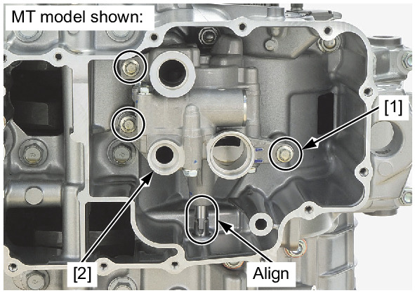

# Oil-Pump

Источник: `Oil-Pump.pdf`

REMOVAL/INSTALLATION 
Remove the oil strainer . 
Remove the oil pump mounting bolts [1] and oil 
pump [2]. 
Installation is in the reverse order of removal. 
TORQUE: 
Oil pump mounting bolt: 
16 N·m (1.6 kgf·m, 12 lbf·ft) 

NOTE: 
* Align the oil pump driven shaft end with the 
oil pump drive shaft groove. 

