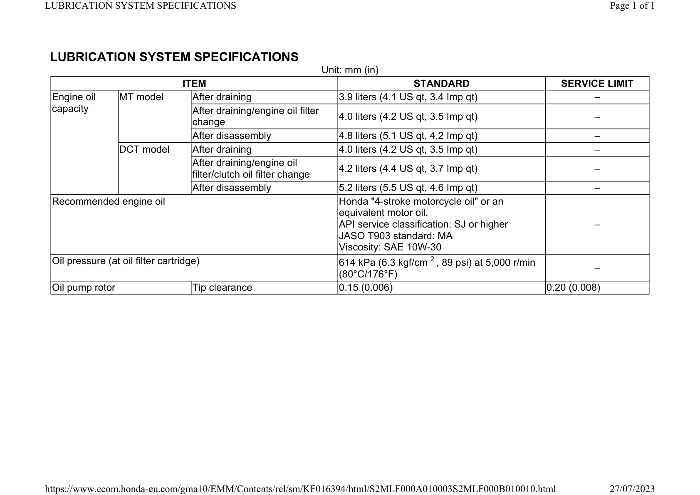

# Oil-Specification

Источник: `Oil-Specification.pdf`

LUBRICATION SYSTEM SPECIFICATIONS 
Unit: mm (in) 
ITEM 
STANDARD 
SERVICE LIMIT 
Engine oil 
capacity 
MT model 
After draining 
3.9 liters (4.1 US qt, 3.4 Imp qt) 
– 
After draining/engine oil filter 
change 
4.0 liters (4.2 US qt, 3.5 Imp qt) 
– 
After disassembly 
4.8 liters (5.1 US qt, 4.2 Imp qt) 
– 
DCT model 
After draining 
4.0 liters (4.2 US qt, 3.5 Imp qt) 
– 
After draining/engine oil 
filter/clutch oil filter change 
4.2 liters (4.4 US qt, 3.7 Imp qt) 
– 
After disassembly 
5.2 liters (5.5 US qt, 4.6 Imp qt) 
– 
Recommended engine oil 
Honda "4-stroke motorcycle oil" or an 
equivalent motor oil. 
API service classification: SJ or higher 
JASO T903 standard: MA 
Viscosity: SAE 10W-30 
– 
Oil pressure (at oil filter cartridge) 
614 kPa (6.3 kgf/cm 2 , 89 psi) at 5,000 r/min 
(80°C/176°F) 
– 
Oil pump rotor 
Tip clearance 
0.15 (0.006) 
0.20 (0.008) 

